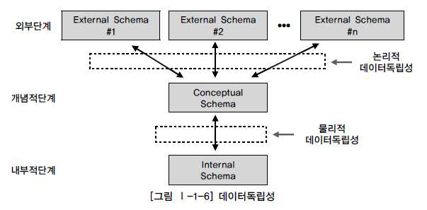
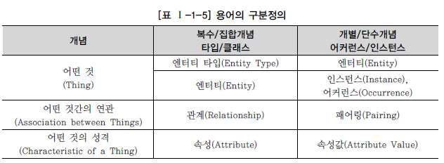
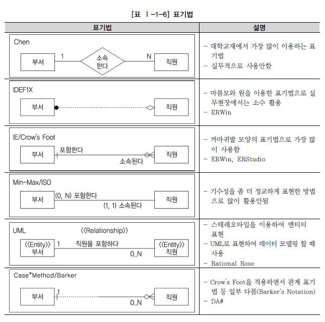
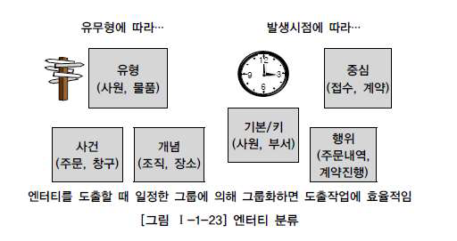
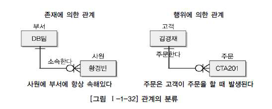
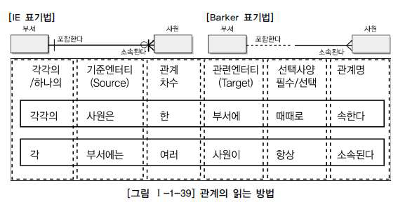
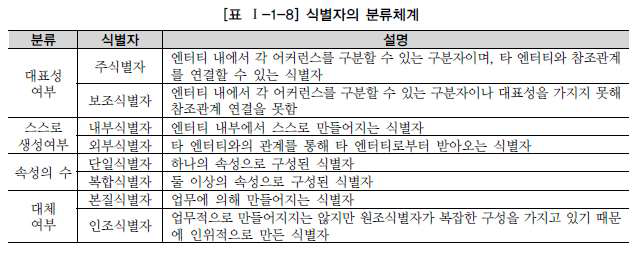

### 1. 모델링의 이해

#### 가. 모델링의 특징

- **추상화** : 현실세계를 일정한 형식에 맞추어 표현을 한다는 의미이다. 즉, 다양한 현상을 일정한 양식인 표기법에 의해 표현하는 것이다.
- **단순화** : 복잡한 현실 세계를 약속된 규약에 의해 쉽게 이해할 수 있도록 하는 개념을 의미한다.
- **명확화** : 누구나 이해하기 쉽게 하기 위해 애매모호함을 제거하고 정확하게 현상을 기술하는 것을 의미한다.

**따라서, 모델링은 "현실 세계를 추상화, 단순화, 명확화하기 위해 일정한 표기법에 의해 표현하는 기법이다."**

#### 나. 모델링의 세 가지 관점

- **데이터 관점** : 업무가 어떤 데이터와 관련이 있는지 또는 데이터간의 관계는 무엇인지
- **프로세스관점** : 업무가 실제하고 있는 일은 무엇인지 또는 무엇을 해야 하는지
- **상관관점** : 업무가 처리하는 일의 방법에 따라 데이터는 어떻게 영향을 받고 있는지

---

### 2. 데이터 모델의 기본 개념의 이해

#### 가. 모델링의 정의

- 업무 정보를 구성하는 기초가 되는 정보들을 일정한 표기법에 의해 표현함으로써 정보시스템 구축의 대상이 되는 업무 내용을 정확하게 분석하는 것이 첫 번째 목표이다.
- 분석된 모델을 가지고 실제 데이터베이스를 생성하여 개발 및 데이터관리에 사용하기 위한 것이다.
- <u>즉, **데이터 모델링**이라는 것은 단지 데이터베이스를 구축하기 위한 용도로만 쓰이는 것이 아니라 데이터 모델링 자체로서 업무를 설명하고 분석하는 부분에서도 중요하다.</u>

#### 나. 데이터 모델이 제공하는 기능

1. 시스템을 현재 또는 원하는 모습으로 가시화하도록 도와준다.
2. 시스템의 구조와 행동을 명세화 할 수 있게 한다.
3. 시스템을 구축하는 구조화된 틀을 제공한다.
4. 시스템을 구축하는 과정에서 결정한 것을 문서화한다.
5. 다양한 영역에 집중하기 위해 다른 영역의 세부 사항은 숨기는 다양한 관점을 제공한다.
6. 특정 목표에 따라 구체화된 상세 수준의 표현 방법을 제공한다.

---

### 3. 데이터 모델링의 중요성 및 유의점

#### 1. 중요성

#### 가. 파급효과

#### 나. 복잡한 정보 요구사항의 간결한 표현

#### 다. 데이터 품질

#### 2. 유의점

#### 가. 중복 데이터

- 여러 장소의 데이터베이스에 같은 정보를 저장하지 않도록 하여 중복성을 최소화한다.

#### 나. 비유연성

- 데이터의 정의를 데이터의 사용 프로세스와 분리하여 유연성을 높인다.

#### 다. 비일관성

- 데이터간의 상호 연관관계를 명확하게 정의하여 일관성 있게 데이터가 유지되도록 한다.

---

### 4. 데이터 모델링의 3단계 진행

- 현실세계에서 데이터베이스까지 만들어지는 과정은 아래 그림과 같이 시간에 따라 진행되는 과정으로서 추상화 수준에 따라, **개념적 데이터 모델, 논리적 데이터 모델, 물리적 데이터 모델**로 정리할 수 있다.

#### 1. 개념적 데이터 모델링

- 추상화 수준이 높고 업무 중심적이고 포괄적인 수준의 모델링 진행

#### 2. 논리적 데이터 모델링

- 시스템으로 구축하고자 하는 업무에 대해 Key, 속성, 관계 등을 정확하게 표현하고 재사용성이 높음
- 즉, 물리적인 스키마를 설계하기 전 단계인 '데이터 모델' 상태를 일컫는 말이다.
- 이 단계에서 정규화, 식별자 확정, M:M 관계 해소, 참조 무결성 규칙 등을 정의한다.

#### 3. 물리적 데이터 모델링

- 실제로 데이터베이스에 이식할 수 있도록 성능, 저장 등 물리적인 성격을 고려하여 설계

---

### 6. 데이터 모델링에서 데이터 독립성의 이해

#### 1. 데이터 독립성의 필요성

- 어떤 단위에 대해 독립적인 의미를 부여하고 그것을 효과적으로 구현하게 되면 다른 기능의 변경으로부터 쉽게 변경되지 않고 자신의 고유한 기능을 제공하는 장점을 가지게 된다.
- **데이터 독립성**을 확보하면 다음과 같은 효과를 얻을 수 있다.
  - 각 View의 독립성을 유지하고 계층별 View에 영향을 주지 않고 변경이 가능하다.
  - 단계별 스키마에 따라 데이터 정의어와 조작어가 다름을 제공한다.

#### 2. 데이터베이스 3단계 구조

1. 외부 스키마
   - 사용자와 가까운 단계로 사용자 개개인이 보는 자료에 대한 관점과 관련이 있는 부분이다.
   - 즉, 사용자가 처리하고자 하는 데이터 유형과 관점, 방법에 따라 다른 스키마 구조를 가지고 있다.
2. 개념 스키마
   - 사용자가 처리하는 데이터 유형의 공통적인 사항을 처리하는 **통합된 뷰**를 스키마 구조로 디자인한 형태이다.
3. 내부 스키마
   - 물리적으로 저장된 방법에 대한 스키마 구조를 말한다.

#### 3. 두 영역의 데이터 독립성

1. 논리적 독립성
   - **개념 스키마**가 변경되어도 외부 스키마에는 영향을 미치지 않도록 지원하는 것
   - 논리적 구조가 변경되어도 응용 프로그램에 영향이 없음
2. 물리적 독립성
   - **내부 스키마**가 변경되어도 외부/개념 스키마는 영향을 받지 않도록 지원하는 것
   - 저장장치의 구조변경은 APP과 개념 스키마에 영향이 없음

---

### 7. 데이터 모델링의 중요한 세 가지 개념

#### 1. 데이터 모델링의 세 가지 요소

1. 업무가 관여하는 어떤 것 (Things)
2. 어떤 것이 가지는 성격 (Attributes)
3. 업무가 관여하는 어떤 것 간의 관계 (Relationships)

- 이 세 가지는 데이터 모델링을 완성해가는 핵심 개념으로서 엔티티, 속성, 관계로 인식되는 것이다.

#### 2. 단수와 집합(복수)의 명명

---

### 9. 데이터 모델의 표기법인 ERD의 이해

#### 1. 데이터 모델 표기법

---

### 10. 좋은 데이터 모델의 요소

#### 1. 완전성 (Completeness)

- 업무에서 필요로 하는 모든 데이터가 데이터 모델에 정의되어 있어야 한다.

#### 2. 중복배제 (Non-Redundancy)

- 하나의 데이터베이스 내에 동일한 데이터는 반드시 한 번만 기록하여야 한다.

#### 3. 업무규칙 (Business Rules)

- 데이터 모델링 과정에서 도출되고 규명되는 수많은 업무규칙을 데이터 모델에 표현하고 이를 해당 데이터 모델을 활용하는 모든 사용자가 공유할 수 있도록 제공하는 것이다.

#### 4. 데이터 재사용 (Data Reusability)

- 신규 정보시스템의 구축 작업은 회사 전체 관점에서 공통 데이터를 도출하고 이를 전 영역에서 사용하기에 적절한 형태로 설계한다.
- 이러한 데이터 설계에서 가장 중요한 것이 데이터 재사용성을 향상시킬 수 있는 **통합 모델**이다.
- 데이터가 App과 독립적으로 설계되어야만 데이터 재사용성을 향상시킬 수 있다.

#### 5. 의사소통 (Communication)

- 데이터를 분석하는 과정에서는 많은 업무 규칙들이 도출되는데 이러한 규칙들을 동일한 의미로 받아들이고 정보시스템을 활용할 수 있게한다.
- 즉, 데이터 모델이 진정한 의사소통의 도구로서 역할을 하게 된다.

#### 6. 통합성 (Integration)

- 가장 바람직한 데이터 구조의 형태는 동일한 데이터는 조직의 전체에서 한번 만 정의되고 이를 다른 영역에서 참조하고 활용하는 것이다.

---

### 11. 엔터티

- **엔터티**란 업무에 필요하고 유용한 정보를 저장하고 관리하기 위한 집합적인 것으로 설명할 수 있다.

#### 1. 엔터티의 특징

- 반드시 해당 업무에 필요하고 관리하고자 하는 정보여야 한다.
- **유일한 식별자**에 의해 식별이 가능해야 한다.
- 영속적으로 존재하는 **두 개 이상의** 인스턴스 집합이어야 한다.
- 업무 프로세스에 의해 이용되어야 한다.
- 반드시 **속성**이 있어야한다.
- 다른 엔터티와 최소 **한 개 이상의 관계**가 있어야 한다. (단, 통계성, 코드성 등은 예외)

#### 2. 엔터티의 분류

##### 1. 유무형에 따른 분류

- **유형엔터티**
  - **물리적인 형태가 있고** 안정적이며 지속적으로 활용되는 엔터티이다.
  - 예를 들면, 사원, 물품, 강사 등이 이에 해당된다.
- **개념엔터티**
  - **물리적인 형태는 없지만** 관리해야 할 개념적 정보로 구분이 되는 엔터티이다.
  - 예를 들면, 조직, 보험상품 등이 이에 해당된다.
- **사건 엔터티**
  - 업무를 수행함에 따라 발생되는 엔터티로서 통계자료에 이용될 수 있다.
  - 예를 들면, 주문, 청구, 미납 등이 이에 해당된다.

##### 2. 발생시점에 따른 분류

- **기본/키 엔터티**
  - 그 업무에 원래 존재하는 정보로서 다른 엔터티와 관계에 의해 생성되지 않고 독립적으로 생성이 가능하고 자신은 타 엔터티의 부모 역할을 하게된다.
  - 다른 엔터티로부터 주식별자를 상속받지 않고 자신의 고유한 주식별자를 갖는다.
  - 예를 들어, 사원, 부서 고객, 상품, 자재 등이 기본/키 엔터티가 될 수 있다.
- **중심 엔터티**
  - 기본 엔터티로부터 발생되고 그 업무에 있어서 중심적인 역할을 한다.
  - 데이터의 양이 많이 발생되고 다른 엔터티와의 관계를 통해 많은 행위 엔터티를 생성한다.
  - 예를 들어, 계약, 사고, 예금원장, 청구, 주문, 매출 등이 될 수 있다.
- **행위 엔터티**
  - 두 개 이상의 부모 엔터티로부터 발생되고 자주 내용이 바뀌거나 데이터량이 증가된다.
  - 예를 들어, 주문 목록, 사원변경 이력 등이 될 수 있다.

#### 3. 엔터티의 명명

- 현업에서 사용하는 용어를 사용한다.
- 약어를 사용하지 않는다.
- 단수명사를 사용한다.
- 모든 엔터티에 유일한 이름이 부여되어야 한다.
- 생성의미대로 이름을 부여한다.

---

### 12. 속성

- 업무에서 필요로 하는 인스턴스로 관리하고자 하는 의미상 더 이상 분리되지 않는 최소의 데이터 단위로 정의할 수 있다.
- 엔터티는 속성들에 의해 설명된다.

#### 1. 엔터티, 인스턴스, 속성, 속성값의 관계

- 한 개의 엔터티는 두 개 이상의 인스턴스의 집합이어야 한다.
- 한 개의 엔터티는 두 개 이상의 속성을 갖는다.
- 한 개의 속성은 한 개의 속성값을 갖는다.

#### 2. 속성의 특징

- 엔터티와 마찬가지로 해당 업무에서 필요하고 관리하고자 하는 정보여야 한다.
- 정규화 이론에 근간하여 정해진 주식별자에 함수적 종속성을 가져야 한다.
- 하나의 속성에는 한 개의 값만을 가진다.

#### 3. 속성의 분류

#### 1. 속성의 특성에 따른 분류

- **기본 속성** 
  - 업무분석을 통해 바로 정의한 속성을 기본속성이라고 하는데, 엔터티에 가장 일반적이다.
  - 코드성 데이터, 일련 번호, 다른 속성을 계산하거나 영향을 받아 생성된 속성을 제외한 모든 속성은 **기본 속성**이다.

- **설계 속성**
  - 업무상 필요한 데이터 이외에 데이터 모델링을 위해, 업무를 규칙화하기 위해 속성을 새로 만들거나 변형하여 정의하는 속성이다.
  - **코드성 데이터, 일련변호**와 같은 속성은 모델 상에서 새로 정의하는 **설계속성**이다.

- **파생속성**
  - 다른 속성에 영향을 받아 발생하는 속성으로서 보통 계산된 값들이 이에 해당된다.
  - 다른 속성에 영향을 받기 때문에 설계 시 데이터 정합성을 유지하기 위해 유의해야 할 점이 많다.

#### 2. 엔터티 구성방식에 따른 분류

- 속성은 그 안에 세부 의미를 쪼갤 수 있는지에 따라 **단순형 혹은 복합형**으로 분류될 수 있다.
- **복합 속성** 
  - 여러 세부 속성들로 구성될 수 있는 것을 말한다.
  - 예를 들어, 주소는 시, 군, 구 등과 같은 여러 세부 속성들로 구성될 수 있다.
- **단순 속성**
  - 더 이상 다른 속성들로 구성될 수 없는 단순한 속성을 말한다.
  - 예를 들어, 나이, 이름 등이 있다.
- **다중값**
  - 어떤 사람의 전화번호는 집, 휴대폰, 회사와 같이 여러 개의 값을 가질 수 있다.
- **단일값**
  - 주민등록번호와 같은 속성은 반드시 하나의 값만 존재한다.

#### 3. 도메인

- 각 속성은 가질 수 있는 값의 범위가 있는데 이를 그 속성의 도메인이라고 한다.
- 각 속성은 도메인 이외의 값을 갖지 못한다.
- 학점이라는 속성의 도메인은 0.0에서 4.0 사이의 실수 값, 주소는 20자리 이내인 문자열로 정의할 수 있다.

#### 4. 속성의 명명

- 해당 업무에서 사용하는 이름을 부여한다.
- 서술식 속성명은 사용하지 않는다.
- 약어 사용은 가급적 제한한다.
- 전체 데이터모델에서 유일성을 확보하는 것이 좋다.

---

### 13. 관계의 표기법

#### 1. 관계의 표기법

#### 가. 관계명

- 관계명은 엔터티가 관계에 참여하는 형태를 지칭한다.
- 각각의 관계는 두 개의 **관계명**을 가지고 있다.
- 애매한 동사를 피한다.
- 현재형으로 표현한다.

#### 나. 관계차수

- 두 개의 엔터티간 관계에서 참여자의 수를 표현하는 것을 관계차수라고 한다.
- 일반적인 관계차수 표현방법은 1:N, 1:1, 1:M이다.

#### 다. 관계선택사항

- 엔터티의 참여 가능 여부에 따라 **필수 참여**와 **선택 참여**로 나뉜다.

---

### 14. 관계의 분류

- 관계는 **존재에 의한 관계**와 **행위에 의한 관계**로 구분될 수 있다.

#### 1. 존재에 의한 관계

- 그림 왼쪽 편에서, 황경빈 사원은 "소속된다"라는 의미는 행위에 따른 이벤트에 의해 발생되는 의미가 아니라 단순히 DB팀에 소속되어 있기 때문에 나타나는 형태에 의해 관계가 형성되는 것이다.

#### 2. 행위에 의한 관계

- 그림 오른쪽 편에서, 김경재 고객은 "주문한다"라는 행위를 하여 CTA201이라는 주문번호를 생성하였다.
- 김경재 고객이 "주문한다"라는 행위에 의해 발생되었기 때문에 두 엔터티 사이의 관계는 행위에 의한 관계가 되는 것이다.

#### 3. UML에서의 관계

- UML에는 클래스다이어그램의 관계중 **연관관계**와 **의존관계**가 있다.
- **연관관계**는 항상 이용하는 관계로 **존재적 관계**에 해당하는데, 표현방법이 **실선**으로 표현된다.
- **의존관계**는 상대방 클래스의 행위에 의해 관계가 형성될 때 표현하며, **점선**으로 표현된다.

---

### 15. 관계의 정의 및 읽는 방법

#### 1. 관계 체크사항

- 두 개의 엔터티 사이에서 관계를 정의할 때 다음 사항을 체크해 보도록한다.
  - 두 개의 엔터티 사이에 관심있는 연관규칙이 존재하는가?
  - 두 개의 엔터티 사이에 정보의 조합이 발생하는가?
  - 업무기술서, 장표에 관계연결에 대한 규칙이 서술되어 있는가?
  - 업무기술서, 장표에 관계 연결을 가능하게 하는 동사가 있는가?

#### 2. 관계 읽기

- 기준 엔터티를 한 개(One) 또는 각(Each)으로 읽는다.

- 대상(Target) 엔터티의 관계참여도, 즉 개수(하나, 하나 이상)을 읽는다.
- 관계선택사양과 관계명을 읽는다.

---

### 16. 식별자

#### 1. 식별자

- 식별자란 하나의 엔터티에 구성되어 있는 여러 개의 속성 중에 엔터티를 대표할 수 있는 속성을 의미하며 하나의 엔터티는 반드시 하나의 유일한 식별자가 존재해야 한다.

#### 2. 식별자의 특징

- 주식별자인지 아니면 외부식별자인지 등에 따라 특성이 다소 차이가 있다.

**주식별자의 경우**

- 주식별자에 의해 엔터티내의 모든 인스턴스들이 유일하게 구분되어야 한다.
- 주식별자를 구성하는 속성의 수는 유일성을 만족하는 최소의 수가 되어야 한다.
- 지정된 주식별자의 값은 자주 변하지 않는 것이어야 한다.
- 주식별자가 지정이 되면 반드시 값이 들어와야 한다. (Null 안됨)

**외부식별자의 경우**

- 참조무결성 제약조건에 따른 특징을 갖는다.

#### 3. 식별자 분류 및 표기법

**1. 주식별자와 보조식별자** : 엔터티 내에서 대표성을 가지는가에 따라서

**2. 내부식별자와 외부식별자** : 엔터티 내에서 스스로 생성되었는지 여부에 따라서

**3. 단일식별자와 복합식별자** : 단일 속성으로 식별이 되는가에 따라서

#### 4. 주식별자 도출기준

##### 1. 해당 업무에서 자주 이용되는 속성을 주식별자로 지정하도록 함

- 사원 테이블에서 **사원 번호**를 주식별자로, **주민번호**를 보조식별자로 사용할 수 있다.

##### 2. 명칭, 내역 등과 같이 이름으로 기술되는 것은 피함

- 명칭, 내역 등과 같이 이름으로 기술되는 것들은 가능하면 주식별자로 지정하지 않도록 한다.

- 한 회사에 부서 이름이 100개가 있다고 할 때, 각각의 부서이름은 유일하게 구별될 수 있다고 하여 부서이름을 주식별자로 지정하지 않도록 한다.

##### 3. 속성의 수가 많아지지 않도록 함

- 주식별자로 선정하기 위한 속성이 복합으로 구성되어 주식별자가 될 수 있을 때, 가능하면 속성의 수가 많지 않도록 해야 한다.

---

#### 5. 식별자 관계와 비식별자 관계의 결정

- 엔터티에 주식별자가 지정되고 엔터티간 관계를 연결하면 부모쪽의 주식별자를 자식엔터티의 속성으로 내려 보낸다.
- 이때, 자식 엔터티에서 부모 엔터티로부터 받은 **외부 식별자**를 주식별자로 이용할 것인지 또는 부모와 연결이 되는 속성으로서만 이요할 것인지를 결정해야 한다.

##### 1. 식별자 관계

- **자식 엔터티의 주식별자로 부모의 주식별자가 상속이 되는 경우를 식별자 관계라고 지칭한다.**

- 부모로부터 받은 식별자를 자식 엔터티의 주식별자로 사용하는 경우 Null 값이 오면 안되므로, 반드시 부모 엔터티가 생성되어야 자기 자신의 엔터티가 생성되는 경우이다.
- 부모로부터 받은 속성만을 주식별자로 사용한다면 1:1 관계가 된다.
- 부모로부터 받은 속성 이외 스스로 가지고 있는 속성을 주식별자로 사용한다면 1:M 관계가 된다.

##### 2. 비식별자 관계

- 부모엔터티로부터 속성을 받았지만, 자식 엔터티의 주식별자로 사용하지 않고 일반적인 속성으로만 사용하는 경우를 말한다.
- 다음의 네 가지 경우에 비식별자 관계에 의한 외부속성을 생성한다.
  - 부모로부터 받은 속성이 필수가 아니기 때문에, 부모없는 자식이 생성될 수 있다.
  - 엔터티별로 데이터의 생명주기를 다르게 관리할 경우이다. 부모 엔터티 인스턴스가 먼저 소멸될 수 있는 경우가 있는데, 이때 비식별자 관계로 조정하는 것이 좋다.
  - 여러 개의 엔터티가 하나의 엔터티로 통합되어 표현되었는데 각각의 엔터티가 별도의 관계를 가질 때 해당된다.
  - 자식 엔터티에 주식별자로 사용해도 되지만, 자식 엔터티에서 별도의 주식별자를 생성하는 것이 더 유리하다고 판단될 때 비식별자 관계에 의한 외부식별자로 표현한다.

##### 3. 식별자 관계로만 설정할 경우의 문제점

- 엔터티들간의 관계가 식별자 관계로만 설정되어 있을 경우, 주식별자의 속성 수가 많아질 수 밖에 없다.
- 자식 엔터티의 PK의 수는 부모 엔터티의 PK 수 + 1이 성립된다.

##### 4. 비식별자 관계로만 설정할 경우의 문제점

- 부모 유형의 속성이 상속되지 않아 데이터를 처리할 때 쓸데없이 부모엔터티까지 찾아가는 경우가 발생한다.

