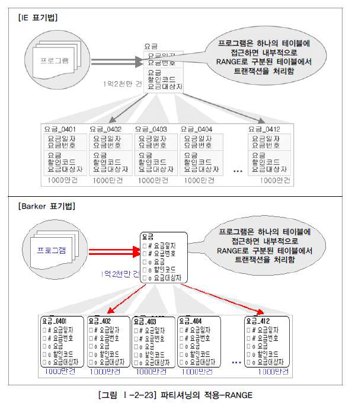

### 1. 성능 데이터 모델링의 개요

#### 1. 성능 데이터 모델링 고려사항

- 데이터 모델링을 할 때 정규화를 정확하게 수행한다.
  - 정규화된 모델이 데이터를 주요 관심사별로 분산시키는 효과가 있기 때문에 그 자체로 성능을 향상시크는 효과가 있다.
- 데이터베이스 용량산정을 수행한다.
  - 각각의 엔터티에 대한 용량산정을 수행하면 어떤 엔터티에 데이터가 집중되는지 파악할 수 있다.
- 데이터베이스에 발생되는 트랜잭션의 유형을 파악한다.
  - CRUD 매트릭스, 시퀀스 다이어그램, 화면 등을 보고 판단할 수 있다.
- 용량과 트랜잭션의 유형에 따라 **반정규화**를 수행한다.
- 이력모델의 조정, PK/FC 조정, 슈퍼타입/서브타입 조정 등을 수행한다.
- 성능관점에서 데이터 모델을 검증한다.

---

### 2.정규화와 성능

- 일반적으로 정규화가 잘 되어 있으면 "입력/수정/삭제"의 성능이 향상되고 반정규화를 많이하면 조회의 성능이 향상된다고 인식된다.
- **하지만**, 이는 고정관념이며 정규화를 해서 성능이 저하되기는 커녕 정규화를 해야만 성능이 향상되는 경우가 많다.

---

#### 6. 함수적 종속성에 근거한 정규화 수행 필요

- 함수의 종속성은 데이터들이 어떤 기준값에 의해 종속되는 현상을 지칭하는 것이다.
- 이때, 기준 값을 **결정자**라고하고 종속되는 값을 **종속자**라고 한다.
- 아래의 그림에서는 **주민등록번호가 이름, 출생지, 주소를 함수적으로 결정한다.**라고 한다.

- 기본적으로 데이터는 속성간의 **함수 종속성**에 근거하여 정규화되어야 한다.

---

### 3. 반정규화와 성능

- 반정규화를 정의하면 엔터티, 속성, 관계에 대해 시스템의 성능향상과 개발과 운영의 단순화를 위해 중복, 통합, 분리 등을 수행하는 데이터 모델링 기법을 말한다.
- **협의의 반정규화**는 데이터를 중복하여 성능을 향상시키기 위한 기법이라고 정의할 수 있다.
- 반정규화를 적용하는 이유는 데이터를 조회할 때 디스크 I/O 량이 많아서 성능이 저하되거나 경로가 너무 멀어 조인으로 인한 성능 저하, 칼럼을 계산하여 읽을 때 성능이 저하될 것이 예상되는 경우이다.

#### 1. 반정규화의 적용방법

- **반정규화의 대상을 조사한다.**
  - 자주 사용되는 테이블에 접근하는 프로세시의 수가 많고 항상 일정한 범위만을 조회하는 경우에 반정규화를 검토한다.
  - 테이블에 대량의 데이터가 있고 대량의 데이터 범위를 자주 처리하는 경우에 처리범위를 일정하게 줄이지 않으면 성능을 보장할 수 없을 경우에 반정규화를 검토한다.
  - 통계성 프로세스에 의해 통계 정보를 필요로 할 때 별도의 통계 테이블(반정규화 테이블)을 생성한다.
  - 테이블에 지나치게 많은 조인(JOIN)이 걸려 데이터를 조회하는 작업이 기술적으로 어려울 경우 반정규화를 검토한다.
- **반정규화 대상에 대해 다른 방법으로 처리할 수 있는지 검토한다.**
  - 지나치게 많은 조인이 걸려 데이터를 조회하는 작업이 기술적으로 어려울 경우 VIEW를 사용하면 이를 해결할 수도 있다.
  - VIEW를 생성하여 개발자가 뷰를 통해 접근하게 함으로써 성능저하의 위험을 예방하는 것도 좋은 방법이 된다.
  - 대량의 데이터를 처리해야할 경우에는 클러스터링이나 인덱스를 적용한다. 클러스터링을 적용할 경우 **입력/수정/삭제**하는 경우 성능이 많이 저하되므로 조회중심의 테이블이 아니라면 생성하지 않아야 한다.
  - 대량의 데이터는 PK의 성격에 따라 부분적인 테이블로 분리할 수 있다. 즉, 데이터가 특정 기준에 의해 다르게 저장되고 파티셔닝 키에 따른 조회가 될 때 성능이 좋아지는 특성이 있다.
  - 응용 프로그램에서 로직을 구사하는 방법을 변경함으로써 성능을 향상시킬 수 있다.
- **반정규화를 적용한다.**

---

### 4. 대량 데이터에 따른 성능

#### 1. 컬럼의 수가 많은 경우

- 한 테이블에 많은 수의 칼럼이 존재하게 되면 데이터가 디스크의 여러 블록에 존재하므로, 디스크에서 데이터를 읽는 I/O 량이 많아지게 되어 성능이 저하되게 된다.
  - 로우 체이닝 현상
    - 테이블에 컬럼의 수가 너무 많은 경우, 로우 길이가 너무 길어서 데이터 블록 하나에 데이터가 모두 저장되지 않고 두 개 이상의 블록에 걸쳐 저장되는 형태가 **로우 체이닝**이다.
  - 로우마이그레이션
    - 데이터 블록에서 수정이 발생하면 수정된 데이터를 해당 데이터 블록에 저장하지 못하고 다른 블록의 빈 공간을 찾아 저장하는 방식이다.

#### 2. 대량의 데이터가 존재하는 경우

- 한 테이블에 대량의 데이터가 존재하는 경우에는 인덱스의 Tree 구조가 너무 커져 효율성이 떨어져 데이터를 처리할 때 디스크 I/O를 많이 유발한다.

#### 3. 대량 데이터 저장 및 처리로 인한 성능

- 테이블에 데이터 양이 많은 경우, 파티셔닝을 적용하거나 PK에 의해 테이블을 분할하는 방법을 적용할 수 있다.

##### 1. RANGE PARTITION 적용

- 하나의 테이블에 너무 많은 데이터가 존재하여 성능이 느린 경우에 해당된다.
- 하나의 테이블을 특정 기간(월별)로 나누어 12개의 파티션으로 나누어, WHERE절에 비교된 일자에 따라 각 파티션에 있는 정보를 찾아간다.
- 즉, 대상 테이블이 날짜 또는 숫자값으로 분리가 가능하고 각 영역별로 트랜잭션이 분리된다면 **RANGE PARTITION**을 적용한다.
- 데이터 보관주기에 따라 데이터를 쉽게 지울 수 있다.

##### 2. LIST PARTITION 적용

- 사업소코드별로 파티셔닝을 할 수 있다.

##### 3. HASH PARTITION

- HASH PARTION은 조건에 따라 해싱 알고리즘이 적용되어 테이블이 분리된다.
- 설계자는 테이블에 데이터가 정확하게 어떻게 들어갔는지 알 수 없으며, 데이터 보관주기에 따라 쉽게 삭제하는 기능도 제공될 수 없다.

---

### 5. 테이블에 대한 수평분할/수직분할의 절차

- 테이블에 대한 수평분할/수직분할에 대한 결정은 다음의 4가지 원칙을 적용하면 된다.

1. 데이터 모델링을 완성한다.
2. 데이터 베이스 용량을 산정한다.
3. 대량 데이터가 처리되는 테이블에 대해서 트랜잭션 처리 패턴을 분석한다.
4. 칼럼 단위 혹은 로우 단위로 집중화된 처리가 발생하는지 분석하여 집중화된 단위로 테이블을 분리하는 것을 검토한다.

---

### 6. 슈퍼타입/서브타입 모델의 성능고려 방법

#### 1. 슈퍼/서브타입 데이터 모델의 변환

- 논리적인 데이터 모델의 분석 단계에서 많이 쓰이는 모델이며, 물리적인 데이터 모델을 설계하는 단계에서는 슈퍼/서브타입 데이터 모델을 일정한 기준에 의해 변환을 해야한다.
- 슈퍼/서브타입에 대한 변환을 잘못하면 성능이 저하되는 이유는 트랜잭션 특성을 고려하지 않고 설계했기 때문인데 이 경우는 다음과 같다.
  - 트랜잭션은 항상 일괄로 처리되는데 테이블은 개별로 유지되어 Union 연산에 의해 성능이 저하된다.
  - 트랜잭션은 항상 서브타입 개별로 처리되는데 테이블은 하나로 통합되어 있어 불필요하게 많은 양의 데이터가 집약되어 있어 성능이 저하되는 경우가 있다.
  - 트랜잭션은 항상 슈퍼+서브 타입을 공통으로 처리하는데 개별로 유지되어 있거나 하나의 테이블로 집약되어 있어 성능이 저하되는 경우가 있다.

#### 2. 슈퍼/서브 타입 데이터 모델의 변환기술

- 슈퍼/서브 타입에 대해 물리적인 데이터 모델로 변환하는 세 가지 유형에 대해 세심하게 적용해야 한다.

1. 개별로 발생되는 트랜잭션에 대해서는 개별 테이블로 구성
   - 슈퍼타입 테이블인 당사자 정보를 미리 조회하고 원하는 내용을 클릭하면 서브타입인 세부적인 정보를 조회하는 방식이다.
   - 이처럼 슈퍼/서브 타입에 독립적으로 트랜잭션이 발생되면 모두 분리하여 1:1 관계를 갖도록 한다.
2. 슈퍼+서브 타입에 대해 발생되는 트랜잭션에 대해서는 슈퍼타입 + 서브타입 테이블로 구성
   - 슈퍼타입과 서브타입을 묶어 트랜잭션이 발생하는 업무특징을 가지고 있을 때에는 슈퍼타입 + 각 서브타입을 하나로 묶어 별도의 테이블로 구성하는 것이 효율적이다.

3. 전체를 하나로 묶어 트랜잭션이 발생할 때는 하나의 테이블로 구성
   - 트랜잭션이 항상 여러 테이블을 통합하여 처리한다고 하면 테이블을 하나로 통합한다.

---

### 7. 인덱스 특성을 고려한 PK/FK 데이터베이스 성능향상

#### 1. PK/FK 칼럼 순서와 성능개요

- PK/FK 칼럼 순서와 성능개요 데이터를 조회할 때 가장 효과적으로 처리될 수 있도록 접근경로를 제공하는 오브젝트가 바로 인덱스이다.
- 인덱스의 특징은 여러 개의 속성이 하나의 인덱스로 구성되어 있을 때 앞쪽에 위치한 속성의 값이 비교자로 있어야 인덱스가 좋은 효율을 나타낼 수 있다.
- 앞쪽에 위치한 속성 값이 가급적 '=' 아니면 최소한 범위 'BETWEEN', '<>' 가 들어와야 인덱스를 이용할 수 있다.

#### 2. PK칼럼의 순서를 조정하지 않으면 성능이 저하되는 이유

- 데이터 모델링에서 엔터티를 설계하면 그에 따라  DDL이 생성되고, 생성된 DDL에 따라 인덱스가 생성된다.
- 이 때, 인덱스는 PK 순서에 따라 생성되는데 이러한 정렬 구조로 인해 데이터를 접근하는 트랜잭션의 조건에 따라 인덱스의 접근방식이 달라지게 된다.

- 아래와 같이 맨 앞에 있느 컬럼이 제외된 상태에서 데이터를 조회할 경우 데이터를 비교하는 범위가 매우 넓어지게되어 성능 저하를 유발한다.

