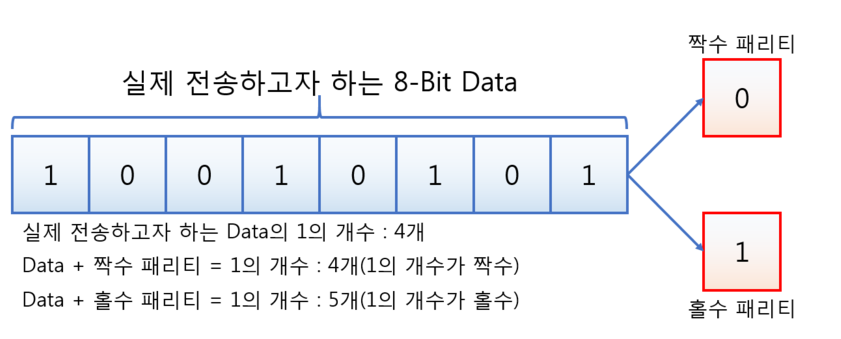
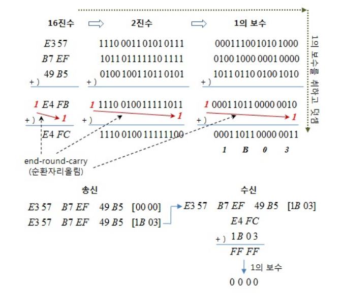

### 1. 패리티 (Parity) 검사

- 데이터 전송 과정에서 오류가 발생했는지를 검사하기 위해 추가된 비트를 `패리티 비트`라고 한다.

- 패리티 검사 방식에는 크게 `홀수 패리티와 짝수 패리티`로 나뉜다.

- 예를 들어 전송할 데이터의 크기가 N 비트라면, 뒤에 패리티 비트 (1 bit)를 추가하여 총 `N+1` 비트를 전송한다.

- 이때, `짝수 패리티`에서는 1의 갯수가 짝수가 되도록 값을 설정하고, `홀수 패리티`에서는 1의 갯수가 홀수가 되도록 값을 설정한다.

  

- 즉, 데이터 수신측에서는 N개의 데이터와 패리티 비트를 검사하여 해당 데이터에 오류가 발생했는지 확인할 수 있다.
- `짝수 패리티`에서 패리티 비트가 1로 설정되어있는데, N개의 bit에서 1의 갯수가 홀수라면 오류가 발생한 것으로 확인하고 해당 데이터에 대한 재전송을 요구한다.

#### * 장단점

- 하나의 패리티 비트만으로 여러 개(N개)의 데이터가 유효한 데이터인지 확인할 수 있다.
- 단, 짝수개의 비트가 동시에 바뀌었을 경우 오류 검출이 되지 않으므로 정확도는 낮다.
- 또한,  오류를 검출할 수만 있는 단점이 있다.

---

### 2. 체크섬 (Check Sum) 검사

- 송신측에서는 데이터 `E357, B7EF, 49B5`를 모두 더한 값을 1의 보수를 취해서 함께 보낸다.

- 수신측에서는 원래 데이터와 `check sum (1B03)`을 더한 후 1의 보수를 취했을 때 값이 0이면 데이터가 정상인 것으로 판단한다.

  

---

### 3.순한 중복 체크 (CRC : Cyclical Redundancy Check) 검사

- 프레임 단위의 오류를 검출할 수 있으나 교정은 불가능한 방식이다.
- `CRC`는 다항식을 이용하여 오류를 검출 할 수 있는 방법으로 성능이 뛰어나 가장 많이 사용된다.
- 2개, 홀수 개의 오류는 100% 검출된다.

#### [송신측]

- 디바이더를 정의한다. (1101 => x3 + x2 + 1)
- 디바이더의 최고차수 (3) 만큼 원본 데이터에 추가한다. (0으로 초기화하여)
- 원본 데이터에 `000`을 더해 만든 확장데이터를 `디바이더`로 나눗셈 연산 (XOR) 연산을하고 그 나머지를 원본 데이터에 붙여서 송신한다.

#### [수신측]

- 송신측으로부터 받은 데이터를 디바이더 (1101)로 나눗셈 (XOR) 연산을 통해 그 나머지가 `000`이면 정상인 것을 확인한다.

#### 예제)

- 원본 데이터는 `110010`이다.
- 디바이더는 `1101`( x3 + x2 + 1) 이다.
- 디바이더의 최고차수(3)만큼의 `0`을 붙여 확장 데이터 `110010000`을 생성한다.
- 확장 데이터와 디바이더를 XOR 연산하여 나머지 `100`을 얻는다.
- 원본데이터 `110010`과 나머지 `100`을 더해, 송신 데이터 `110010100`을 보낸다.
- 수신측은 수신받은 데이터 `110010100`을 디바이더 `1101`과 XOR 연산을 하여 그 나머지가 `000`임을 확인한다.

---

### 4. 해밍 (Hamming Code) 코드 검사

- 해밍 패리티 비트는, `1, 2, 4, 8, 16, ... 32` 처럼 2p 번째에 있는 비트를 제외하고 정보를 싣는다.
- 패리티 비트의 갯수는 2p >= d + p + 1이다. `p는 패리티 비트의 수, d는 데이터 비트의 수`
- 오류검출과 교정이 가능한 코드로 2비트의 오류 검출 및 1비트의 오류 교정이 가능한 방식이다.

 

#### 송신측 예제)

- `110010`을 해밍코드를 적용하여 전송비트를 생성하시오.
- 2p >= p + d + 1 공식을 이용해서 2p - p = 7 이므로, p는 4이다.
- 총 전송 비트는 `6 + 4 = 10`이다.

| 비트위치 | 1    | 2    | 3    | 4    | 5    | 6    | 7    | 8    | 9    | 10   |
| -------- | ---- | ---- | ---- | ---- | ---- | ---- | ---- | ---- | ---- | ---- |
| 기호     | p1   | p2   | d3   | p4   | d5   | d6   | d7   | p8   | d9   | d10  |
| 데이터값 |      |      | 1    |      | 1    | 0    | 0    |      | 1    | 0    |
| p1       | 1    |      | 1    |      | 1    |      | 0    |      | 1    |      |
| p2       |      | 1    | 1    |      |      | 0    | 0    |      |      | 0    |
| p4       |      |      |      | 1    | 1    | 0    | 0    |      |      |      |
| p8       |      |      |      |      |      |      |      | 1    | 1    | 0    |
| 생성비트 | 1    | 1    | 1    | 1    | 1    | 0    | 0    | 1    | 1    | 0    |

- 위의 표는 `짝수 패리티`를 적용했을 때의 결과이다.
- 즉, 생성 비트는 `1111100110`이다.

#### 수신측 예제)

- 10진수 50(110010)을 송신측에서 전송하고, 수신측에서 `1101100110`으로 수신한 경우 에러가 발생한 비트를 수정하시오.

| 비트위치  | 1    | 2    | 3    | 4    | 5    | 6    | 7    | 8    | 9    | 10   |
| --------- | ---- | ---- | ---- | ---- | ---- | ---- | ---- | ---- | ---- | ---- |
| 기호      | p1   | p2   | d3   | p4   | d5   | d6   | d7   | p8   | d9   | d10  |
| 수신한 값 | 1    | 1    | 0    | 1    | 1    | 0    | 0    | 1    | 1    | 0    |
| p1        | 1    |      | 0    |      | 1    |      | 0    |      | 1    |      |
| p2        |      | 1    | 0    |      |      | 0    | 0    |      |      | 0    |
| p4        |      |      |      | 1    | 1    | 0    | 0    |      |      |      |
| p8        |      |      |      |      |      |      |      | 1    | 1    | 0    |

- `짝수 패리티`로 선정했으므로, 해당 패리티 비트가 맞다면 0, 틀리면 1로 설정한다.

| 구분      | 패리티 비트   | 처리과정                                                     | 결과            |
| --------- | ------------- | ------------------------------------------------------------ | --------------- |
| 오류추적  | p1            | 1,0,1,0,1                                                    | 틀렸으므로 1    |
|           | p2            | 1,0,0,0,0                                                    | 틀렸으므로 1    |
|           | p4            | 1,1,0,0                                                      | 맞았으므로 0    |
|           | p8            | 1,1,0                                                        | 맞았으므로 0    |
| 오류 수정 | 부분결과 정리 | p8,p4,p2,p1 순으로 정리하면  0011이고 10진수로 변환하면 3이다. | 3번째 비트 오류 |
|           | 원본비트      | 1101100110                                                   |                 |
|           | 수정비트      | 1111100110                                                   |                 |

