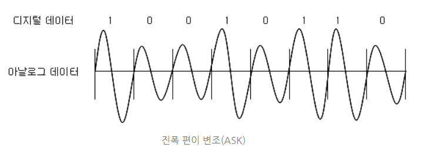
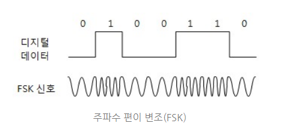
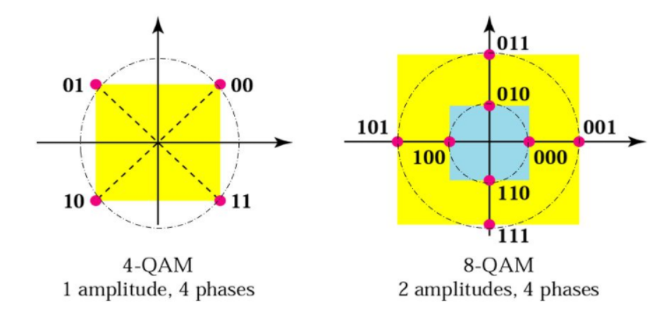
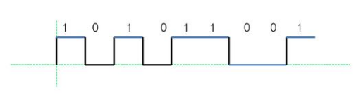
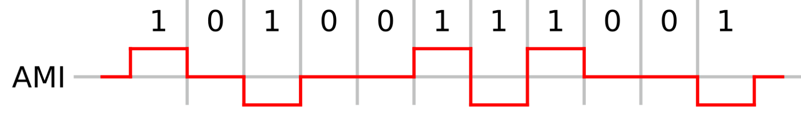
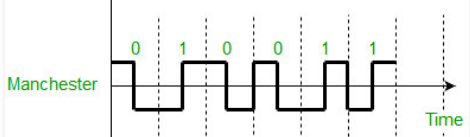

### 1. Modem의 신호 변환 방식

#### 1.1 ASK (진폭 편이 변조)

- 디지털 신호 (0과 1)에 따라 진폭을 다르게 변조하는 방식이다.
- 신호 변동과 잡음에 약하여 데이터 전송용으로 거의 사용되지 않는다.

#### 1.2 FSK (주파수 편이 변조)

- 디지털 신호(0과 1)에 따라 주파수를 다르게 변조하는 방식이다.
- 신호 변동과 잡음에 강하며 넓은 대역폭을 차지한다.

#### 1.3 PSK (위상 편이 변조)

- 디지털 신호(0과 1)에 따라 서로 다른 위상을 갖는 신호로 변조하는 방식이다.
- `PSK`는 2위상, 4위상, 8위상 편이 변조 등이 있다.
- 위상을 높일 경우, 각 신호들간의 차이점이 명확하지 않아 수신측에서 잘못된 신호로 인식할 수 있다.

#### 1.4 QAM

- `ASK와 PSK` 방식을 함께 사용하는 방식으로 적은 신호의 수로도 많은 데이터를 전송할 수 있다.
- `PSK` 방식만을 사용했을 때 각 신호들끼리의 차이점이 아주 적어 발생했던 문제를 조금이나마 완화할 수 있다.

---

### 2. 주파수와 전송용량

#### 2.1 Nyquest의 전송용량

- `Nyquest 공식`은 잡음과 왜곡이 없는 이상적인 채널에서의 `최대 전송율`을 정의한다.
- 무잡음 채널에서 채널용량은 전송채널의 대역폭 제한을 받는다.
- C = 2Wlog2L [bps] 을 만족한다. (C = 채널 용량, W = 전송채널의 대역폭, L = 신호레벨)

#### 2.2 Shannon의 전송용량

- 신호 대 잡음비와 관련시켜 채널의 `최대 전송율`을 정의한다.
- 신호 대 잡읍비는 신호에 존재하는 잡음을 수치화한 식으로 dB로 나타낸다.
- C = Wlog2(1 + S / N) [bps] 를 만족한다. (C = 채널 용량, W = 전송채널의 대역폭, S/N = 신호대 잡음비)

---

### 3. DSU(Digital Service Unit)의 신호 변환 방식

- 네트워크 간에 서로 다른 디지털 신호를 사용하기 때문에 필요한 네트워크 연결 장비이다.
- 하나의 디지털 신호로 통합하지 못하는 이유는 네트워크 간의 `상호 보안 문제`가 발생하기 때문이다.
- `DSU`는 네트워크 간의 서로 다른 디지털 신호를 변환시켜주는 역할을 한다. (디지털 → 디지털)

#### 3.1 단극  RZ

- 전압을 양극이나 음극 중 하나만 사용하여 단극이라고 하며 입력 데이터가 1이면 전압을 발생시키고 0이면 전압을 발생시키지 않는 방식이다.

#### 3.2 양극 NRZ

- 전압을 양극과 음극 모두 사용하여 양극이라고 하며 입력 데이터가 1이면 양극, 0이면 음극을 발생시키는 방식이다.

#### 3.3 바이폴라 (Bipolar)

- `AMI (교호 반전 부호)` 방식으로 양극, 음극, Zero를 모두 사용하며 입력 데이터가 0이면 Zero 전압을 발생시키고, 1이면 양극과 음극을 교대로 변환하는 방식이다.

#### 3.4 맨체스터

- 하나의 펄스폭을 2개로 나누어 1과 0을 반대로 구성하여 사용한다.

---

#### 4. CODEC의 신호 변환 방식

- 아날로그 데이터를 전송하기 위해서 이를 디지털 신호로 변환하고 다시 그 디지털 신호를 아날로그 신호로 복조하는 장비이다.
- `CODEC`의 주요 기술로는 `PCM(Pulse Code Modulation)`이 있다.

#### 4.1 PCM (Pulse Code Modulation)

- 음성이나 동영상 같은 아날로그 신호를 디지털 신호로 변환하는 방법으로 다음 과정을 거쳐 신호를 변환한다.
- `표본화(Sampling) → 양자화(Quantizing) → 부호화(Encoding) → 복호화(Decoding) → 필터링(Filtering)`

1. 표본화(Sampling)
   - 아날로그 신호를 일정한 간격으로 나누어 표본을 만드는 과정이다.
   - 주파수가 N이라고 할 때, 2N 이상의 주파수로 균일한 시간 간격동안 표본화를 진행하면 원래의 신호가 가진 모든 정보를 포함할 수 있다.
   - `표본화`에 의해 검출된 신호를 `PAM(Pulse Amplitude Modulation)` 신호라고 하는 아날로그 신호가 생성되고 `양자화`를 거쳐 디지털 신호로 변환된다.
2. 양자화(Quantizing)
   - 표본화된 `PAM` 신호를 유한 개의 대표 값으로 조정하는 과정이다.
   - 실수 형태의 PAM 신호를 반올림하여 정수형으로 만든다.
   - `양자화 레벨`은 `PAM`신호를 부호화할 때 2진수로 표현할 수 있는 레벨을 말하는 것으로 표본당 전송비트가 3비트이면, `양자화 레벨`은 8이라고 할 수 있다.
   - 즉, L = 2b (L = 양자화 레벨, b = 표본당 전송 비트 수)
3. 부호화(Encoding)
   - 부호화는 양자화된 `PAM`신호의 진폭 크기를 2진수로 나타내는 과정이다.
   - 이 과정을 거친 신호를 `PCM`이라고 한다.
4. 복호화(Decoding)
   - 수신된 디지털 신호(PCM)을 `PAM` 신호로 되돌리는 과정이다.
5. 필터링(Filtering)
   - `PAM` 신호를 아날로그 신호로 복원하는 과정이다.