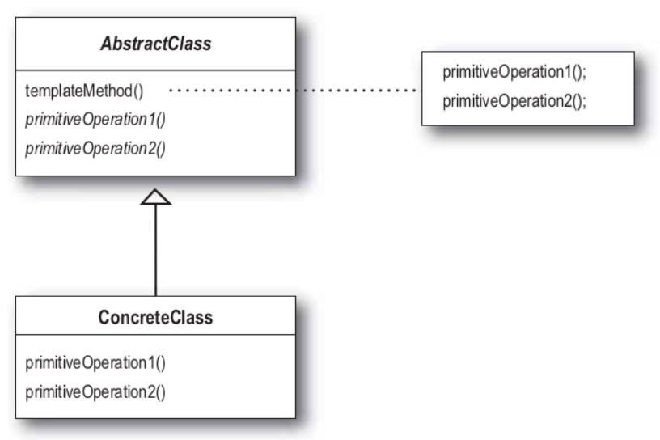

### 1. 전략 패턴

- `전략 패턴`에서는 변경이 필요한 알고리즘을 인터페이스를 통해 통째로 외부로 분리시키고, 알고리즘 클래스를 필요에 따라서 바꿔서 사용할 수 있게 하는 디자인 패턴이다.
- `전략 패턴`을 사용하면 알고리즘을 사용하는 클라이언트와는 독립적으로 알고리즘을 변경할 수 있다.


---

### 2. 옵저버 패턴

- `옵저버 패턴`에서는 한 객체의 상태가 바뀌면 그 객체에 의존하는 다른 객체들한테 연락이 가고 자동으로 내용이 갱신되는 방식으로 일대다 의존성을 가지는 패턴이다.


---

### 3. 팩토리 메소드 패턴

- `팩토리 메소드 패턴`은 클래스의 인스턴스를 생성하는 일을 서브 클래스에게 위임하는 패턴이다.
- 즉, 객체의 생성 코드를 별도로 분리함으로써 객체 생성의 변화에 대비하는데 유용하다.


1. Product
   - `피자, 태그` 인터페이스 혹은 슈퍼 클래스
2. ConcreteProduct
   - `치즈 피자, 불고기 피자, 네이버, 다음` 등의 서브 클래스
3. Creator
   - `피자 스토어, Tag 팩토리` 등 객체 생성 기능을 추상화한 인터페이스
4. ConcreteCreator
   - 실제 객체를 생성하는 구상 팩토리 클래스??

---

### 4. 스테이트 패턴

- `스테이트 패턴`을 이용하면 객체의 내부 상태가 바뀜에 따라서 객체의 행동을 바꿀 수 있다.
- 마치 객체의 클래스가 바뀌는 것과 같은 결과를 얻을 수 있다.

1

1. Context 클래스
   - 여러 가지 내부 상태를 가질 수 있는 클래스
   - request()가 호출되면 `상태 객체`에게 작업을 위임한다.
2. State 인터페이스
   - 모든 구상 클래스에 대한 공통 인터페이스를 정의한다.
3. ConcreteState 클래스
   - `Context 클래스`로부터 전달된 요청을 처리하는 구상 클래스이다.
   - 각각의 구상 클래스들은 요청을 처리하는 방법을 각자의 방식대로 정의한다.
   - `Context 클래스`에서 상태를 바꾸기만 하면 행동도 같이 바뀌게 된다.

---

### 5. 커맨드 패턴

- 실행될 기능을 캡슐화함으로써 주어진 여러 기능을 실행할 수 있는 재사용성이 높은 클래스를 설계하는 패턴이다.


1. invoker
   - 리모컨, ok구글 등, 커맨드를 실행시키는 주체
2. Command
   - `전등 켜기, 전등 끄기, TV 켜기, TV 끄기` 등과 같은 행동 하나하나 객체
3. Receiver
   - `전등, TV`등 요구사항을 수행하는 객체???

---

### 6. 템플릿 메소드 패턴

- `템플릿 메소드 패턴`은 슈퍼클래스에서 알고리즘의 알고리즘의 골격을 정의한다.
- 그리고 변하지 않는 부분은 슈퍼 클래스에 두고 변하는 부분은 추상 메소드로 정의하여 서브 클래스에서 오버라이드하여 새롭게 정의한다.



```java
abstract class AbstractClass{
    final void template(){
        oper1();
        oper2();
    }
    public abstract void oper1();
    public abstract void oper2(); 
}

class ConcreteClass extends AbstractClass{
    public void oper1(){
        //구현
    }
    public void oper2(){
     	//구현   
    }
}
```

---

### 7. 이터레이터 패턴

- `이터레이터 패턴`은 컬렉션 구현 방법을 노출시키지 않으면서도 그 집합체 안에 들어있는 모든 항목에 접근할 수 있게 해주는 패턴이다.


1. Aggregate
   - 이터레이터를 생성하는 인터페이스 (메뉴)
2. ConcreteAggregate
   - 이터레이터를 생성하는 구현 클래스
   - 예제에서는 `PancakeHouse, DinnerMenu, CafeMenu`등
3. Iterator
   - 임의의 자료구조에 접근할 수 있도록 하는 메소드들을 제공하는 인터페이스
4. ConcreteIterator
   - ....구현하는 인터페이스
   - List나 Map과 같이 Java에서 이미 iterator를 제공하는 컬렉션들은 `iterator` 인터페이스를 구현할 필요 없음.
   - 배열과 같이 기존에 iterator를 제공하지 않는 자료구조를 가진 얘들만 하셈

---

