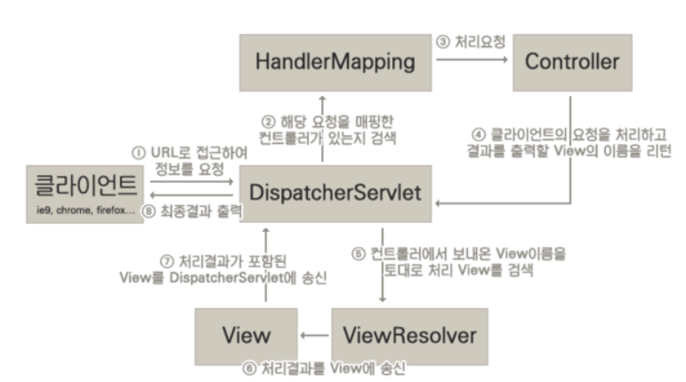

### 1. 스프링 MVC의 동작과정




#### 1. URL로 접근하여 정보를 요청

- 클라이언트가 해당 어플리케이션에 접근하면 접근한 URL 요청을 `DispatcherServlet`이 가로챈다.
- 그 이유는 `web.xml`에 `DispatcherServlet의 <url-pattern>`이 '/' 와 같이 해당 웹 어플리케이션의 모든 URL로 등록되어 있기 때문이다.


#### 2. 해당 요청을 매핑한 컨트롤러가 있는지 검색

- 가로챈 요청을 `HandlerMapping`에게 보내 해당 요청을 처리할 수 있는 `Controller`를 찾아낸다.
- 이때,  어떤 `HandlerMapping`을 사용해야 할지의 여부를 지정해야하는데 아래와 같이 두 개의 구현체가 주로 사용된다.

| 구현체                    | 설명                                                         |
| ------------------------- | ------------------------------------------------------------ |
| BeanNameUrlHandlerMapping | 요청 URL와 동일한 이름을 가진 Controller 빈을 매핑한다.      |
| SimpleUrlHandlerMapping   | Ant 스타일의 경로 매핑 방식을 이용하여 Controller 빈을 매핑한다. |

- `BeanNameUrlHandlerMapping`은 요청 URI와 동일한 이름을 갖는 `Controller` 빈으로 하여금 클라이언트의 요청을 처리할 수 있도록한다.
- 예를 들어, `sise.me/hello.do` 와 같은 요청 URL에 대해서 `/hello.do`라는 이름을 가진 Controller 빈이 해당 요청을 처리할 수 있도록 한다.


#### 3. Controller에게 처리 요청

- `HandlerMapping`이 해당 요청을 처리할 `Controller`를 찾아냈다면 `Controller` 객체의 `handlerRequest()` 메소드를 호출하여 클라이언트의 요청을 처리한다.


#### 4. 결과를 출력할 View의 이름을 리턴

- ` handleRequest` 메소드는 `ModelAndView` 객체를 `DispatcherServlet`에게 리턴한다.


#### 5. View 이름을 토대로 View 검색

- `DispatcherServlet`은 리턴받은 `View 이름`을 토대로 `ViewResolver`를 통해 어떤 `View`를 보여줄지 선택하게 된다.

- `ViewResolver`에는 주로 다음의 두 가지가 사용된다.

  1.  InternalResourceViewResolver  : JSP를 사용하여 View를 생성한다.
  2.  VelocityViewResolver  : Velocity 템플릿 엔진을 사용하여 View를 생성한다.

  

#### 그 이후 과정

- 해당 View가 있다면 처리 결과를 View에 보낸 후, 이 결과를 다시 `DispatcherServlet`에 보낸다.
- `DispatcherServlet`은 최종 결과를 클라이언트에게 응답으로 돌려준다.

---

### 2. Resources 매핑

- 모든 요청 URL을 `DispatcherServlet`이 가로챌경우 CSS, HTML 등과 같은 정적 파일에 대한 요청은 처리할 수 없다.
- 이런 경우, 정적 파일에 대한 요청은 `DistpatcherServlet`이 가로채지 못하게 하는 방법이 있다.
- `web.xml`에 아래와 같은 설정을 함으로써 해결할 수 있다.

```xml
<resources mapping="/resources/**" location="/resources/" />
```

- 이 방식은, `DispatcherServlet`이 해당 요청 URL에 매핑된 Controller를 찾지 못하는 경우 2차적으로 /resources/ 경로에서 해당 자원을 찾도록 한다.

- 현대의 대형 웹 어플리케이션들은 정적 파일에 대한 리소스들을 철저하게 분리해서 운영하고 있다.
- 예로는 http://static.naver.net 등이 있다.

