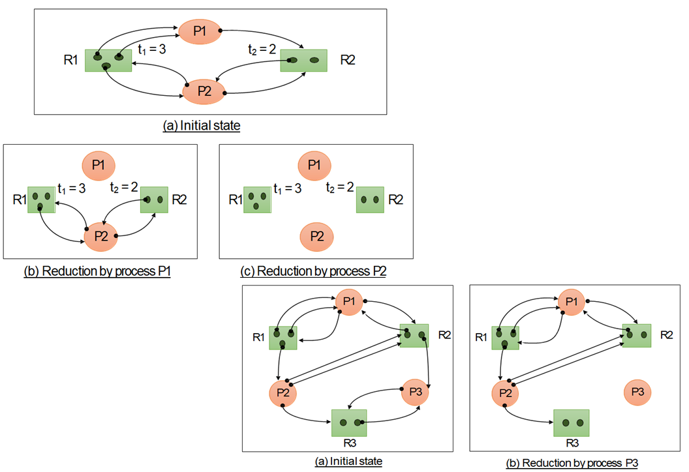

## 1. 교착상태 (Dead Lock)이란?

- `교착 상태`란 서로 상대방의 작업이 끝나기 만을 기다리고 있기 때문에 결과적으로 아무것도 완료되지 못하는 상태를 말한다.
- 다중 프로그래밍 환경에서는 여러 프로세스들이 한정된 자원을 사용하려고 서로 경쟁할 수 있다.
- 한 프로세스가 자원을 요청했을 때, 그 자원을 사용할 수 없는 상황이 발생할 수 있고, 그 경우 프로세스는 다시 대기 상태로 돌아간다.
- 이처럼, 임의의 프로세스 A가 요청한 자원들이 다른 프로세스들에 이해서 점유되고 있고 그 프로세스들도 프로세스 A가 사용하는 자원을 요구할 때 발생한다.

### 1-1. 교착상태 필요조건

- `교착 상태`는 한 시스템에 다음 네 가지 조건들이 동시에 성립될 때 발생할 수 있다.

1. **상호 배제 (Mutual Exclusion)**
   - 최소한 하나의 자원에 대해 `상호 배제` 원칙을 지켜야한다.
2. **보유 및 대기 (Hold and Wait)**
   - 프로세스는 최소한 하나의 자원을 보유한 채, 다른 프로세스에 의해 점유된 자원을 얻기 위해 대기해야한다.
3. **비선점 (No Preemption)**
   - 자원을 선점할 수 없어야 한다. 즉, 사용되고 있는 자원은 프로세스가 자발적으로 방출할 때에만 방출할 수 있다.
4. **환형대기 (Circular wait)**
   - 대기하고 있는 프로세스들이 서로 다른 프로세스가 점유한 자원을 원형으로 대기하는 형태이다.

### 1-2. 교착상태 vs 기아상태

- `교착 상태`는 발생 가능성이 없는 이벤트를 기다리는 경우이다. 이때 프로세스의 상태는 `wait`상태이다. 즉, 다른 자원을 무한히 기다리는 상태라고 할 수 있다.
- `기아 상태`는 CPU를 선점하기 위해 `Ready Queue`에서 기다리는 상황인데, 이 상황 자체가 발생 가능성이 없는 이벤트를 기다리는 것은 아니다. 즉, 우선순위나 CPU 스케줄링에 의해 본인의 실행시점이 계속해서 미뤄지는 상황이다.
- `기아 상태`에서의 프로세스 상태는 `ready` 상태이다.

## 2. 교착상태 예방 (Deadlock Prevention)

- `교착 상태` 문제를 처리하는 데는 첫 번째로 교착상태 자체를 예방하는 것이다.
- 즉, `상호 배제`, `보유 및 대기`, `환형 대기` , `비선점` 등과 같이 `교착 상태`의 원인이 되는 문제 자체를 부정해버리는 방법이다.
- 그러나, 이런 방식을 사용하면 장치의 이용률과 시스템 처리율이 감소된다는 단점이 있다.

## 3. 교착상태 회피 (Deadlock Avoidance)

### 3-1. 안전 상태 (Safe State)란?

- `안전 상태`란 시스템이 어떤 순서로든 프로세스들이 요청하는 모든 자원을 `교착 상태`를 야기시키지 않고 모두 할당해 줄 수 있다는 것을 뜻한다.
- `{ P1, P2, P3, ..., Pn }` 과 같은 Process Sequence가 안전하다는 말은 현재 시스템에 남아있는 자원의 양과 앞에서 수행을 마칠 프로세스들  Pj (j < i) 들이 반납하는 자원으로 만족시킬 수 있다는 것을 말한다.
- 만약, Pi가 요청할 자원들을 즉시 만족시키지 못할 경우, 프로세스 Pi로 하여금 모든 Pj들이 작업을 마칠 때 까지 기다리게 하면 된다.

### 3-2. 은행원 알고리즘 (Banker's Algorithm)

- `은행원 알고리즘`은 운영체제가 `안전 상태`를 유지할 수 있는 프로세스의 요청에만 자원을 할당하고 `불안전한 상태`를 초래하게 될 요청은 계속해서 미루는 알고리즘이다.

#### [예시]

- 아래의 예시처럼 시스템의 총 자원수는 12이고, 프로세스 {P1, P2, P3}의 최대 요청 자원수와 현재 요청 자원수가 아래와 같다고 하자.

| 프로세스 | 최대 요청 자원 수 | 현재 요청 자원 수 |
| -------- | ----------------- | ----------------- |
| P1       | 10                | 5                 |
| P2       | 4                 | 2                 |
| P3       | 9                 | 2                 |

1. 프로세스 `{P1, P2, P3}` 가 현재 요청하는 자원 수를 할당하고 나면 시스템에는 `12 - 9 = 3`의 자원이 남게된다.
2. 이 상황에서 `P2`가 필요로 하는 자원 2개를 추가로 할당하면, `P2` 프로세스 작업은 끝나게 되고 모든 자원을 반납하게 되어 시스템의 총 자원은 5개가 된다.
3. 다시, `P1`이 필요로 하는 자원 5개를 추가로 할당하면, `P1` 프로세스의 작업이 끝나게 되고 시스템 자원은 총 10개가 된다.
4. 마지막으로 `P3`가 필요로 하는 자원 7개를 할당하게 되면, `P3`의 작업이 끝나게 되고 최종적으로 시스템이 `안전 상태`에서 모든 프로세스의 작업을 마칠 수 있다.

## 4. 교착상태 탐지 (Deadlock Detection)

- `교착 상태` 문제를 사전에 예방하는 방법도 있지만, `교착 상태` 가 발생할 수 있는 상황을 허용하고, 실제로 `교착 상태`가 발생했을 때 탐지하여 회복시키는 방법이 있다.

### 4-1. Resource Allocation Graph (RAG) 사용

- `교착 상태`를 검출하기 위해 사용되는 그래프이다.

  1. `RAG`는 방향 그래프이다. G = (N, E)
  2. 노드 N은 N = {Np, Ne}로 표현할 수 있는데, Np 는 프로세스의 집합이고, Ne는 자원의 집합이다.
  3. tk 는 Rk의 자원의 수이다.
  4. |(a,b)|는 노드 a와 b를 잇는 간선의 갯수이다.

- `RAG` 그래프를 활용하여 `교착 상태`를 탐지하는 방법은 주어진 `RAG`에서 간선을 하나씩 지워가는 방법이 있다.

- 모든 간선을 지울 수 있다면, 시스템에 `교착 상태`가 발생하지 않은 것이고,  간선이 존재한다면 하나 이상의 프로세스가 `교착 상태`에 빠졌다는 것이다.

- 지울 수 있는 간선의 프로세스를 `unblocked process`라고 하는데, 이를 탐지하는 방법은 아래와 같다.

- 프로세스 Pi가 자원 Rj에 대한 요청 갯수가 자원 Rj의 자원들 중에 남은 자원의 수보다 작거나 같으면 해당 간선을 지울 수 있다.

  

### 5. 교착 상태 회복 (Deadlock Recovery)

- 탐지 알고리즘을 통해 교착 상태가 발생했다고 인지하면 아래와 같은 방법을 통해 회복할 수 있다.
  1. `순환 대기`를 깨뜨리기 위해 단순히 한 개 이상의 프로세스를 중지시키는 것이다.
  2. `교착 상태`에 있는 하나 이상의 프로세스들로부터 자원을 `선점`하는 것이다.

#### 5-1. 프로세스 종료

1. 교착상태 프로세스를 모두 중지

   - 이 방식은 확실하게 `교착 상태` 에서 벗어날 수 있지만, 비용이 크다.
   - 그 이유는 각각의 프로세스가 처리했던 작업 모두를 폐기해야하고, 다시 실행해야 하기 때문이다.
   - 만약, 프로세스가 파일에 `쓰기`작업을 하는 도중에 종료시킬 경우 그 파일의 데이터는 `부정확`한 상태가 된다.

   

2. 교착상태를 벗어날 때 까지 프로세스를 하나씩 중지

   - 이 방식은 프로세스가 중지될 때 마다 `탐지 알고리즘`을 적용해야 하기 때문에 상당히 큰 오버헤드를 유발한다.
   - 교착 상태인 프로세스 집합 중에서 어떤 프로세스를 중지해야할지 반드시 결정해야 한다.
   - 이 과정에서 발생하는 (스케줄링하는) 과정 자체가 비용으로 작용될 수 있다.

#### 5-2 자원 선점

- `자원 선점`을 이용해 교착상태를 제거하려면, 교착상태에서 벗어날 때 까지 프로세스로부터 자원을 계속적으로 선점하여 다른 프로세스에게 주어야 한다.
- `자원 선점` 방식으로 교착 상태를 회복할 때 고려해야할 사항은 아래와 같다.

1. **희생자 선택**
   - 비용을 최소화 하기 위해서 선점의 순서를 결정해야 한다. 
   - 비용 요인으로는 점유하고 있는 `자원의 수`, 해당 프로세스가 현재까지 실행하는데 `소요된 시간` 과 같은 매개변수들이 포함될 수 있다.
2. **후퇴 (rollback)**
   - 프로세스를 선점하게 되면, 해당 프로세스는 정상적으로 실행할 수 없다.
   - 가장 확실한 방법은 완전 후퇴 (프로세스를 종료하는 것)이지만, 비용 절감을 위해 `교착상태`를 벗어날 수 있는 수준까지만 후퇴시키는 것이다.
3. **기아상태**
   - `희생자 선택`이 비용 요인에 의해 적용되는 시스템에서는 계속해서 같은 프로세스가 `희생자` 로 선택될 수 있다.
   - 이 경우에, 계속해서 `희생자`로 선택되는 프로세스는 결코 자신의 작업을 완료할 수 없을 것이다.
   - `기아 상태`를 방지하기 위해  비용 요소에 `선택된 횟수`를 포함시키기도 한다.