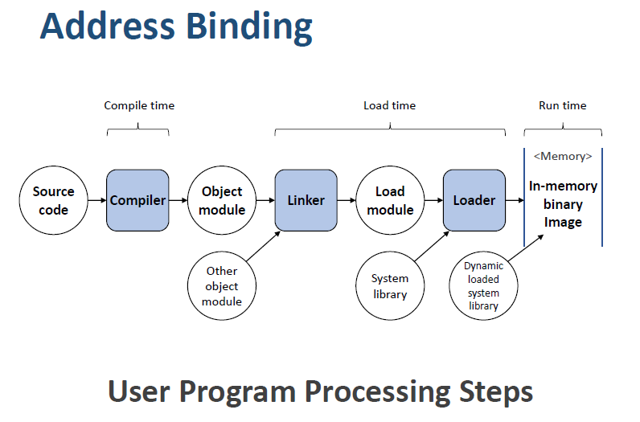

## 메모리 관리 전략

#### 용어 확인

1. Block : 보조기억장치와 주기억장치 사이의 데이터 전송 단위 (1~4KB)
2. Word : 주기억장치와 CPU 레지스터 사이의 데이터 전송 단위 (16~64bit)

### 1. 주소의 할당 (Address Binding)

- 프로그램은 실행 파일 형태로 디스크에 저장되어 있는데, 이 프로그램이 실행되기 위해서는 메인 메모리에 적재되어 `프로세스`가 되어야 한다.
- 디스크에서 메인 메모리로 들어오기를 기다리고 있는 프로세스들의 집합을 이른바 `입력 큐(input queue)`라고 부른다.
- 또한, 프로그램의 논리 주소를 실제 메모리의 물리 주소로 매핑하는 작업을 `주소의 할당`이라고 할 수 있다.

#### 1-1. 컴파일 시간 바인딩 (Compile Time Binding)

- 프로세스가 컴파일 시점에 메모리에 적재될 위치를 미리 알 수 있는 경우이다.
- 예를 들어, 프로세스가 R번지로부터 시작한다는 것을 미리 알 수 있으면 번역할 코드를 그 위치에서 시작해 나간다.

#### 1-2. 적재 시간 바인딩 (Load Time Binding)

- 메모리 적재 위치를 컴파일 시점에 모르면, 우선 대체 가능한 상대주소를 생성한다.
- `적재 시점`에 시작 주소를 반영하여 주소를 재설정하는 방법이다.
- 예를 들어, 상대 주소를 `R + 100`이라고 지정해 놓은 후 실제 적재될 메모리 시작 주소가 100이라고 하면, `100 + 100` 으로 변환되는 것이다.

#### 1-3. 실행 시간 바인딩 (Execution Time Binding)

- `주소 할당`을 실행 시간까지 연기하는 방법이다.
- 즉, 프로세스의 상태가 `Ready -> Running` 상태가 될 때 물리 주소를 할당하는 것이다.
- 이 방법을 사용하기 위해서는 하드웨어인 MMU (Memory Management Unit)이 필요하다.

---

### 2. 메모리 할당 기법

#### 2-1. 최초 적합 (First - Fit)

- 첫 번째 사용 가능한 가용 공간을 할당한다. 만약, 첫 번째 사용 가능한 공간이 요구 공간보다 매우 클 경우 공간 활용률이 많이 낮아질 수 있다.
- 충분한 크기를 가진 첫 번째 Partition을 선택하기 때문에 다른 기법들과 비교해봤을 때 가장 빠른 기법으로 오버헤드가 가장 작다.

#### 2-2. 최적 적합 (Best - Fit)

- 사용 가능한 공간들 중에서 가장 작은 것을 택한다.
- 리스트가 크기 순으로 정렬되어 있지 않다면 전체 탐색을 요구한다.
- 크기가 큰 Partition을 유지하기에는 적합하지만, 작은 크기의 Partition이 많이 생긴다.

#### 2-3. 최악 적합 (Worst - Fit)

- 사용 가능한 공간들 중에서 가장 큰 것을 택한다.
- 이 방법 또한, 크기 순으로 정렬되어 있지 않다면 전체 탐색을 요구한다.
- 큰 크기의 Partition 확보가 어려울 수 있지만, 작은 Partition의 비율을 줄일 수 있다.

#### 2-4. 순차 최초 적합 (Next-Fit)

- 최초 적합 전략과 유사하지만, `State table`에서 마지막으로 탐색한 위치부터 탐색한다.
- 메모리 영역의 사용 빈도를 균등화할 수 있다.

---

### 3. 동적 적재 (Dynamic Loading)

- 메모리 공간을 보다 효율적으로 이용하기 위해서는 `동적 적재`를 해야한다.
- `동적 적재`에서 각 루틴 (함수 등)은 실제 호출되기 전까지는 메모리에 올라오지 않고 디스크에서 대기하고 있다.
- `메인` 프로그램이 메모리에 적재되어 실행되다가 루틴의 호출 시점에 `주소 할당`을 수행하여 각각의 루틴을 수행하는 방식이다.
- 이러한 방식은, `오류 처리`와 같이 간혹 발생하지만 많은 양의 코드를 필요로 하는 경우에 유용하다.

---

### 4. 스와핑 (Swapping)

- 프로세스가 실행되기 위해서는 메인 메모리에 적재되어 있어야 하지만 프로세스는 실행 중에 임시로 `예비 저장장치 (backup store)`로 보내졌다가 실행을 계속하기 위해 메모리로 돌아올 수 있다.
- `스와핑`이 발생하는 시점은 `ready`상태 에서와 `asleep` 상태에서 발생한다.

- `예비 저장장치(backup store)` 의 크기는 모든 사용자의 메모리 이미지를 저장할 수 있을만큼 커야하며 이 메모리 이미지에 대한 직접 접근이 가능해야한다.
- `스와핑`은 메모리 혼잡 상태를 개선하거나, 가용 메모리보다 요청 메모리의 크기가 클 때 수행된다.

---

### 5. 연속 메모리 할당 (Contiguous Memory Allocation)

- 메모리는 일반적으로 운영체제를 위한 공간과 사용자 프로세스를 위한 것으로 나눌 수 있다.

- `연속 메모리 할당` 시스템에서는 각 프로세스는 다음 프로세스를 포함하는 메모리 영역과 연속된 하나의 메모리 영역을 차지하게 된다.

- **즉, 프로세스를 하나의 연속된 메모리 공간에 할당하는 정책이다.**

  

#### 5-1. 고정 분할 기법 (Fixed Partition Multiprogramming) - FPM

- 메모리를 고정된 크기로 미리 분할하는 방법이다.
- 각 분할 (partition) 마다 하나의 프로세스를 갖기 때문에 분할의 갯수를 다중 프로그래밍의 정도라고 부른다.
- 이 기법은 `단편화`가 발생하여 메모리 자원이 낭비될 수 있다.

#### 5-2. 가변 분할 기법 (Variable Partition Multiprogramming) - VPM

- 시스템이 부팅된 직후에는 운영체제가 차지하는 메모리 영역을 제외한 나머지 영역은 하나의  공간이다.
- 이때, 시스템에 들어오는 프로세스가 요구하는 메모리만큼만을 할당하는 기법이다.
- 프로세스가 요구하는 메모리만큼 할당하기 때문에 `내부 단편화`는 발생하지 않는다.

---

### 6. 메모리 단편화

- `메인 메모리`에서 메모리 공간이 작은 공간으로 나누어져 전체적으로는 충분한 가용 공간이 있지만, 사실상 프로세스에 할당 될 수 없는 것을 `메모리 단편화`라고 한다.

#### 6-1. 내부 단편화(Internal Fragmentation)이란?

- 프로세스에 메모리를 할당할 때, 프로세스가 필요로 하는 공간보다 더 많은 공간을 할당하여 메모리가 낭비되는 현상을 `내부 단편화`라고 한다.

#### 6-2. 외부 단편화(External Fragmentation)이란?

- 메모리 중간 중간에 비어있는 공간은 충분하지만, 메모리가 연속되지 않아 프로세스가 메모리에 적재될 수 없는 상태를 `외부 단편화`라고 한다.

---

### 7. 메모리 단편화 해결방법

#### 7-1. 공간 통합 (Coalescing holes)

- 단편화로 인해 분산된 메모리 공간을 인접해있는 메모리 공간끼리 통합시켜 더 큰 메모리 공간으로 합치는 기법이다.

#### 7-2. 메모리 압축 (Storage Compaction)

- 단편화로 인해 분산된 메모리 공간을 하나로 합치는 기법이다.
- 즉, 프로세스에 할당된 메모리 공간을 한 군데로 몰고, 가용 가능한 공간들은 다른 한 군데로 몰아서 큰 블록을 만드는 것이다.
- 단, `메모리 압축` 방식은 모든 프로세스를 재배치해야 하기 때문에 모든 프로세스의 작업이 중단되고, 많은 시스템 자원을 소비한다.

---

### 8. 비연속 메모리 할당 (Non-Contiguous Memory Allocation)

- `연속 메모리 할당`방식으로 발생하는 `단편화` 문제를 해결하기 위해 사용하는 기법이다.
- 실행 시, 필요한 `block`들만 메모리에 적재하고 나머지 `block`들은 `swap device`에 존재하게 된다.
- 이러한 기법에는 `페이징`, `세그먼트` 기법이 있다.

---

### 9. 페이징 (Paging)

- `페이징`이란 프로세스와 메인 메모리를 같은 크기의 일정한 단위로 쪼개어 메모리를 할당하는 방식이다.
- 일정한 크기로 나뉜 프로세스를 `페이지`라고 하며, 일정한 크기로 나뉜 메모리를 `프레임`이라고 한다.
- 즉, 각각의 `페이지`에 할당될 `프레임`의 크기가 같기 때문에 `외부 단편화`는 발생하지 않는다.
- 하지만, 프로세스의 크기가 `페이지`의 크기의 배수가 아니라면, 프로세스의 `마지막 페이지`는 내부 단편화가 발생한다. `(내부 단편화의 최대 크기 = 페이지의 크기 - 1)`

#### 페이징을 활용한 비연속 메모리 할당 과정

1. CPU가 생산하는 `논리 주소는 하위 n비트와 상위 m-n비트`로 구성된다.
   1. `상위 m-n`비트는 페이지 번호를 엑세스할 때 사용된다. `페이지 테이블`은 각 페이지가 점유하는 주소 `(몇 번째 프레임)` 을 가지고 있다.
   2. `하위 n비트`는 페이지 오프셋을 나타내는데, 실제 물리 메모리 주소는 `페이지 주소 + 변위`를 더한 값이 된다.
2. CPU가 생산하는 논리주소로부터 `페이지 번호` 를 계산하여 `페이지 테이블`을 참조한다.
   1. `페이지 테이블`에 해당 `페이지 번호`가 존재하지 않으면 (page fault 혹은 miss) `swap device`에서 해당 `페이지`를 메모리로 적재시킨 후, `페이지 테이블`을 갱신한다.
   2. `페이지 테이블`에 해당 `페이지 번호`가 존재하면 그와 매핑된 `프레임 번호`를 반환한다.
3. `프레임 번호`와 `변위 값`을 통해 실제 메모리에 접근한다.

---

### 10. Page Mapping Table (PMT) 의 종류

- 각 운영체제는 `PMT`를 저장하기 위한 고유의 방법을 가지고 있다.
- 몇몇 OS는 프로세스마다 하나의 `PMT`를 할당한다. 디스패처가 어떤 프로세스를 시작시킬 때, 사용자 레지스터를 적재하는 과정에서 사용자 `PMT`로부터 하드웨어 페이지 테이블 값을 복원한다.

#### 1. 레지스터를 활용한 구현

- `PMT`를 레지스터로 구현하는 방법으로써 `논리주소 => 물리주소` 변환 과정이 매우 빠른 것이 특징이다. 
- 하지만, 일반적으로 `PMT`의 크기는 1백만 항목에 이를 만큼 매우 크므로, 레지스터로 구현하는 것은 매우 부적절하다.

#### 2. 메인 메모리를 활용한 구현

- `레지스터`를 활용한 방법 대신, 대부분의 컴퓨터는 `PMT`를 메인 메모리에 저장하는 방식을 채택한다.
- `PMT`를 메인 메모리에 저장하고 `PTBR (Page Table Base Register)` 로 하여금 `PMT`를 가리키도록 한다. 다른 `PMT`를 사용하려면 `PTBR` 값만 변화시키면 된다.
- 이 방식의 문제점은 메모리 접근 시간이다. 만약 임의의 주소 a 에 접근하기 위해서는 `PTBR`을 통해 메인 메모리에 있는 `PMT`에 한 번 접근해야 하고, `PMT`를 통해 실제 물리 메모리 주소를 계산한 뒤에 접근할 수 있다.
- 즉, 페이지 테이블을 위한 메모리 접근 한번, 그 메모리 자체를 위한 접근 한번, 총 두배의 시간이 소요된다.

#### 3. TLB (Translation Look-aside Buffers)를 활용한 구현

- 위의 문제를 해결하기 위해 `TLB`라고 불리는 특수항 하드웨어 캐시가 사용된다.
- `TLB`는 페이지를 찾는 과정을 병렬로 수행하여 빠른 수행속도를 보장한다.
- `TLB`는 `PMT`와 함꼐 사용된다. `TLB`는 `PMT`의 일부분만을 저장한다.
- 이때, 지역성의 원칙(?)에 따라 최근에 사용한 페이지를 `TLB`에 적재한다.

#### TLB를 활용한 주소 변환 과정

1. CPU가 논리주소를 생성하면 해당 페이지 번호가 TLB에 전달된다.
   1. TLB가 병렬 수행을 통해 `페이지 번호`를 발견하면 해당 `프레임 번호`를 즉시 알 수 있다.
   2. `페이지 번호`가 발견되지 않으면 (TLB miss 라고한다.) `PMT`에 접근하기 위해 메모리 참조가 발생한다. 이때, 새로운 `페이지 번호와 프레임 번호`를 `TLB`에 저장하여 다음 참조시에 빠르게 처리할 수 있도록 한다.
2. TLB를 통해 얻어진 `프레임 번호`를 통해 직접 메모리를 참조한다.