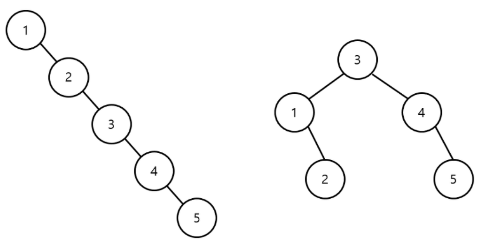

### 1. 이진탐색트리란?

- `이진탐색트리`란 효율적인 탐색능력은 유지하면서 빈번한 데이터 저장과 삭제가 용이하게끔 고안된 자료구조이다.
- `이진탐색`은 탐색에 소요되는 시간 복잡도는 O(logN)이지만, 데이터의 저장과 삭제가 불가능하다.
- `연결리스트`는 데이터의 저장과 삭제에 걸리는 시간 복잡도는 O(1)이지만, 탐색에 소요되는 시간은 O(N)이다.
- `이진탐색트리`는 이러한 단점들을 극복하는 자료구조로써 다음과 같은 조건을 만족시킨다.
  1. 모든 키는 __유일하다.__
  2. 왼쪽 서브트리의 모든 키 값은 루트 노드의 키 값보다 __작다.__
  3. 오른쪽 서브트리의 모든 키 값은 루트 노드의 키 값보다 __크다.__
- 다음 그림은 `이진탐색트리`의 조건을 만족한다.


---

### 2. 데이터 탐색

- `이진탐색트리`에서 데이터를 탐색하는 과정은 다음과 같다.
  1. 찾고자하는 키 값과 루트노드의 키 값을 비교한다.
  2. `찾을 값 < 루트노드의 값`이면 루트노드의 왼쪽 서브트리를 기준으로 탐색을 진행한다.
  3. `찾을 값 > 루트노드의 값`이면 루트노드의 오른쪽 서브트리를 기준으로 탐색을 진행한다.

#### 최소값과 최대값은?

- `이진탐색트리`에서 최소값은 항상 트리의 맨 왼쪽에 저장되고 최대값은 항상 트리의 맨 오른쪽에 저장된다.

---

### 3. 데이터 저장

- `이진탐색트리`에 데이터를 저장하는 과정은 다음과 같다.
  1. 저장할 키 값과 루트노드의 키 값을 비교한다.
  2. `저장할 값 < 루트노드의 값`이면 루트 노드의 왼쪽 서브트리에 저장한다.
  3. `저장할 값 < 루트노드의 값`이면 루트 노드의 오른쪽 서브트리에 저장한다.

- `이진탐색트리`에서 데이터를 저장할 때에는 두 개의 포인터가 필요하다.
  1. 첫 번째, 데이터가 저장될 위치를 가리키는 __포인터 (cur)__
  2. 두 번째, __cur 포인터__의 부모 노드를 가리키는 __포인터 (parent)__

```java
BST_INSERT(Tree, data)
    parent ← null;
    cur ← root of Tree;

	while cur is not null do
        parent ← cur;
		if(key[cur] > data)
            cur ← left[cur];
		else
            cur ← right[cur];

	if parent is null
        root of Tree ← data;
	else if key[parent] > data
        left[parent] ← data;
	else
        right[parent] ← data;
```

---

### 4. 데이터 삭제

- `이진탐색트리`에서 데이터 삭제 과정은 크게 세 가지로 나눌 수 있다.
  1. 자식 노드를 갖지 않는 경우
  2. 하나의 자식 노드를 갖는 경우
  3. 두개의 자식 노드를 갖는 경우


#### 4.1 자식 노드를 갖지 않는경우

- 아래 그림에서 노드 3을 삭제하기 위해서 단순히 부모 노드와의 연결을 끊으면 된다.


#### 4.2 하나의 자식 노드를 갖는 경우

- 아래 그림에서 노드 2를 삭제하기 위해서는 자신의 부모 노드와 자신의 자식 노드를 연결해주면 된다.
- 즉, `연결 리스트`의 삭제 연산과 같다.


#### 4.3 두 개의 자식 노드를 갖는 경우

- 아래 그림에서 노드 4를 삭제하기 위해서 어떤 과정을 거치는지 살펴보자.


- `이진탐색트리`의 전제조건을 만족하기 위해 다음을 고려한다.
  - 노드 4보다 작은 값들 중 가장 큰 값을 찾는다. (위에서는 노드 3)
  - 노드 4보다 큰 값들 중 가장 작은 값을 찾는다. (위에서는 노드5)
  - 두 노드 중 하나를 삭제할 노드의 값에 덮어씌운다.

- 아래 그림은, 노드 5를 선택한 것이다.


---

### 5. 시간 복잡도

- `이진탐색트리`의 높이를 h라고 했을 때 각각의 연산에 대한 시간 복잡도는 다음과 같다.

#### 5.1 탐색과 저장

- 탐색 대상을 찾기 위해 `루트 노드 → 단말 노드`까지 탐색을 반복하므로 O(log<sub>N</sub>)만큼의 시간이 걸린다.
- 저장 위치를 찾는 시간 복잡도도 마찬가지이다.

#### 5.2 삭제

- 삭제 대상을 찾기 위해 `루트 노드 → 단말 노드`까지 탐색을 반복하므로 O(log<sub>N</sub>)만큼의 시간이 걸린다.
  - 삭제 대상의 자식 노드가 `0개 이거나 1개일 경우` 삭제하는데 걸리는 시간은 O(1)이다.
  - 삭제 대상의 자식 노드가 `2개일 경우` `Successor`를 찾는데 걸리는 시간이 추가로  O(log<sub>N</sub>)만큼의 시간이 걸리고,  삭제하는데 걸리는 시간은 O(1)이다.

---

#### 6. 이진탐색트리의 단점

- `이진탐색트리`의 시간 복잡도는 트리의 높이에 의존한다.
- 일반적으로  O(log<sub>N</sub>)만큼의 시간이 걸리지만, 트리의 균형이 맞지 않을수록 O(N)만큼의 시간이 걸린다.
- 아래 그림을 보자.



- 왼쪽 그림은 1부터 5까지 순서대로 저장했을 때의 `이진탐색트리`의 모습이고, 오른쪽 그림은 `3을 먼저` 저장한 `이진탐색트리`의 모습이다.
- 이처럼, 저장순서가 조금만 바뀌어도 트리의 균형이 완전히 달라질 수 있다.