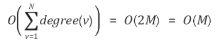

### 1. 신장트리 (Spanning Tree)란?

- `신장트리`란 그래프 중 모든 정점이 간선으로 이어져있고 사이클이 없는 그래프를 말한다.
- `N개`의 정점이 있을 때, `N-1`개의 간선을 이용하여 모든 정점들을 잇는 그래프를 `신장트리`라고 한다.


### 2. 최소비용 신장트리(Minimum Spanning Tree) 란?

- `최소비용 신장트리`란 그래프에서 가능한 `신장트리` 중에서 가중치의 합이 최소인 신장트리를 말한다.


- 위의 왼쪽 그래프에서 `신장트리`는 여러 개가 존재한다는 것을 알 수 있다.
- 단, 간선들의 합이 최소인 `최소비용 신장트리`는 오른쪽 그림처럼 유일하다. (위의 그림에서만 유일하다.)


### 3. 크루스칼 알고리즘

- 크루스칼 알고리즘은 `최소비용 신장트리`를 구하는 알고리즘 중 하나이다.
- 크루스칼 알고리즘의 과정은 다음과 같다.
  - 간선들의 가중치를 오름차순으로 정렬한다.
  - 간선들을 하나씩 선택하되, 이미 선택된 간선들과 사이클이 발생하면 선택하지 않는다.
  - `N-1`개의 간선이 선택되면 종료한다.

``` 
MST_KRUSKAL(G, W)
    A is Empty
    for each vertex v ∈ V[G] do
        MAKE_SET(v);

	sort edge of E order by asc;

	for each edge(u,v) ∈ E do
        if FIND(u) != FIND(v) then
        	A ← A U edge(u,v)
        	UNION(u, v)
	return A;
```

#### 시간 복잡도

- 모든 간선을 오름차순으로 정렬하는데 걸리는 시간 복잡도는 O(ElogE)이다.
- 모든 간선을 순회하는데 걸리는 시간은 O(E)이다.
- `Union-Find`연산을 수행하는데 걸리는 시간은 O(1)이다.
- 즉, 크루스칼 알고리즘의 시간 복잡도는 `O(E + ElogE) → O(ElogE)`이다.

---

#### 4. 프림 알고리즘

- `프림 알고리즘`은 임의의 노드부터 출발하여 `신장트리`의 집합을 단계적으로 확장해나간다.
- `프림 알고리즘`의 과정은 다음과 같다.
  - 임의의 노드를 출발 노드로 선택한다.
  - 출발 노드를 포함하는 트리를 점점 확장해간다.
  - 매 단계에서 `신장 트리`에 포함된 노드와 포함되지 않은 노드를 연결하는 간선들 중 최소 가중치를 가진 간선을 선택한다.

```JAVA
MST_PRIM(G, W, s) //S는 시작 노드
    for each u ∈ V[G] do
        key[u] ← ∞
        π[u] ← null
    
    V is empty
	key[s] ← 0
	
    while |V| < N do
        find u ∉ V the minimum key[u]
        V ← V U u
        for each vertex ∉ V adjacent to u do
            if key[vertex] > w(u, vertex) then
                key[vertex] ← w(u, vertex)
                π[vertex] ← u
```


#### 시간 복잡도

- 집합 V의 크기가 N이 될때까지  걸리는 시간은 O(N)이다.
- 집합 V에 속하지 않고 가장 작은 key 값을 찾는데 걸리는 시간은 O(N)이다.
- 최소 키 값을 갖는 노드 u와 인접한 노드들의 수는 최대 degree(u) = N-1 이므로, 노드 u와 인접한 노드들의 key 값을 갱신하는 연산에 걸리는 시간은 O(logN)이다.
- 즉, `프림 알고리즘`의 시간 복잡도는 O(N(N + N-1)) → O(N<SUP>2</SUP> + N<SUP>2</SUP> - N) → O(N<SUP>2</SUP>)이다.


#### 더 생각해보기

- 집합 V에 속하지 않고 가장 작은 KEY 값을 찾기위해 `우선순위 큐`를 사용하면 시간 복잡도를 줄일 수 있다.

```java
MST_PRIM(G,W,s)
    for each u ∈ V[G] do
        key[u] ← ∞
        π[u] ← null
        
	key[s] ← 0
    Q ← V[G]
    
    while Q is not empty do
        u ← EXTRACT_MIN(Q)
        	for each v adjacent to u do
                if v ∈ Q and key[v] > w(u, v) then
                    key[v] ← w(u, v)
                    π[v] ← u
```

- `우선순위 큐`의 크기가 0이 될 때까지 반복하므로 O(N)이다.

- `우선순위 큐`에서 최소 값을 찾는데 걸리는 시간은 O(logN)이다.

- 노드 u에 인접한 모든 노드 v를 찾는데 걸리는 시간 복잡도는 모든 노드들의 차수의 합만큼 반복하므로 시간 복잡도는 O(2M) → O(M)이다.

  

  - 위 식은 `모든 노드들의 차수의 합은 간선의 갯수에 2배를 한것보다 크거나 같다.`라는 성질을 활용한 것이다.

- `우선순위 큐`를 활용하기 때문에 노드 u와 인접한, 노드 v의 key 값을 비교하여 갱신하는 시간 복잡도는 O(logN)이다.

- 즉, 전체 시간 복잡도는 `O(NlogN + MlogN) → O(MlogN)`이다.

