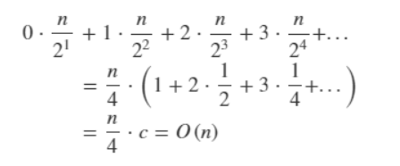
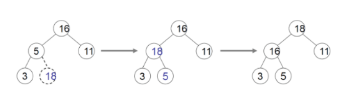

### 1. 힙(Heap)이란?

- 힙은 최대값 및 최소값을 찾아내는 연산을 빠르게 하기 위해 `완전이진트리`를 기본으로 한 자료구조이다.
- 힙의 형태는 아래 그림과 같이 한 노드가 최대 두 개의 자식 노드를 가지며, `마지막 레벨`을 제외한 모든 레벨은 노드가 꽉 채워진 `완전이진트리`이다. 
- 마지막 레벨의 노드들은 왼쪽부터 저장되어 있다.


#### 최소힙과 최대힙

- `최소힙`은 부모 노드의 키 값이 자식 노드의 키 값보다 항상 작은 힙을 `최소힙`이라하고, 부모 노드의 키 값이 자식 노드의 키 값보다 항상 큰 것을 `최대힙`이라고 한다.
- 위의 그림은 `최대힙`이다.


#### 힙을 배열로 표현하기

- 힙은 완전이진트리이기 때문에 `배열`로 표현할 수 있다.

```java
A[i]를 부모노드라고 할 때, 
왼쪽 자식노드는 A[i*2-1] 로 표현할 수 있고 오른쪽 자식노드는 A[i*2]이다. 
```


- 위의 왼쪽 그림의 힙을 오른쪽 배열로 나타낼 수 있다.

---

### 2. 힙 만들기

- 주어진 `완전이진트리`를 힙의 형태로 만드는 연산을 일반적으로 `heapify`라고 한다.


- 위의 그림은 `완전이진트리`를 `최대힙`으로 변환하는 과정이다.
  1. 노드 4와 14의 자리를 바꾼다.
  2. 노드4와 8의 자리를 바꾼다.

```java
// N/2번째 노드부터 HEAPIFY 연산을 진행한다.
BUILD_MAX_HEAP(A)
    len ← length of A
    for i ← len to 1
        HEAPIFY(A, i);
```

```JAVA
// 현재 노드 i부터 leaf node까지 재귀적으로 SWAP_NODE() 연산을 진행한다.
HEAPIFY(A, i)
    if A[i] is leaf node
        return;
	k ← index of ther bigger child of i
    if A[i] >= A[k]
        return;
	SWAP(A[i], A[k]);
	SWAP_NODE(A, k);
```

---

### 3. Build_Heap의 시간 복잡도

- `Heapify`연산은 leaf node에 대해서는 할 필요가 없기 때문에, `Hepify`연산의 횟수는 총 `N/2`번 이다.
- 즉, `N/2`번 각각에 대해 `Hepify`연산이 몇번 발생하는지 알 수 있다면 시간 복잡도를 계산할 수 있다.
- 임의의 노드 `idx`가 있을 때, 해당 노드부터 발생하는 `Hepify`연산의 횟수는 `노드 idx부터 leaf node`까지의 거리이므로, 최대 log<sub>N</sub>번 이라고 할 수 있다.
- 즉, T(N) = N / 2 x log<sub>N</sub>  = N x log<sub>N</sub>만큼의 시간이 걸리는 것을 알 수 있다.


#### 진짜 O(Nlog<sub>N</sub>)만큼 걸릴까?

- 실제로 힙 연산은 O(Nlog<SUB>N</SUB>)보다 적은 시간이 걸린다.
- 아래 그림을 보자.


- 모든 `레벨`에 노드가 꽉 차 있는 `포화이진트리`가 있다고 가정하자.
- 마지막 레벨을 `L`이라고 했을 때, 레벨 `L`에 있는 각각의 노드들 (N / 2개) 에 대해서 `Heapify`연산에 걸리는 시간은 O(0)이다. <u>(leaf node이므로)</u>

- 레벨 `L-1`에 있는 각각의 노드들 (N /4 개) 에 대해서 `Heapify`연산에 걸리는 시간은 O(1)이다.
- 이를 수식으로 나타내면 아래와 같다.



- 즉, N개로 이루어진 `완전 이진트리`를 힙으로 변환하는 데 걸리는 시간은 O(N)만큼의 시간이 걸린다.

---

### 4. 데이터 저장하기

- `힙`에 데이터를 저장할 때, 힙이 `완전 이진트리`라는 점을 상기하자.
- 그렇기 떄문에, 새로운 데이터가 `힙`에 저장될 때에는 `힙`의 마지막 레벨의 맨 오른쪽에 추가해야한다.



1. 힙의 마지막 레벨, 맨 오른쪽에 `18`을 저장한다.
2. `18`과 `5`의 관계가 `최대힙`의 전제조건을 만족하지 않으므로 `18과 5`의 위치를 바꾼다.
3. 즉, 자식노드에서부터 부모노드와 비교하며 루트노드까지 올라간다.

---

### 5. 데이터 삭제하기

- `힙`에서 데이터를 삭제할 때, 우선순위가 높은 데이터 (루트 노드)만 삭제할 수 있다.
- 아래 그림을 보자.


1. 루트 노드 `18`을 힙에서 삭제한다.
2. 마지막 단말 노드 `5`를 루트노드로 이동시킨다.
3. 루트 노드에 대해서 `Heapify`연산을 진행한다.

---

### 6. 데이터 저장과 삭제의 시간 복잡도

- 데이터를 삭제하고 저장하는데 각각 O(1)만큼의 시간이 걸린다.
- <u>데이터 저장의 경우</u>, `자식노드 → 부모노드`까지 비교하면서 자리를 바꿔주는데 걸리는 시간은 O(log<SUB>N</sub>)이다.
- <u>데이터 삭제의 경우</u>, `부모노드 → 자식노드`까지 `Heapify` 연산을 하는데 걸리는 시간은 O(log<SUB>N</sub>)이다.
- 즉, 데이터 저장과 삭제 모두 O(Nlog<SUB>N</sub>)의 시간이 소요된다.